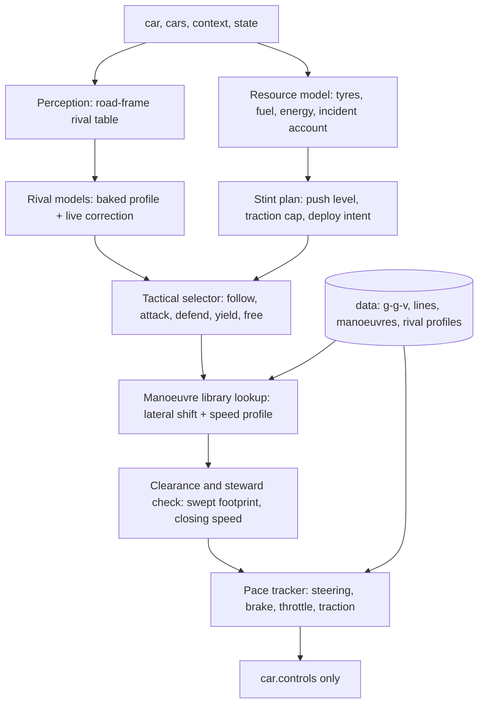

# APEX: a pace-model racer with offline-precomputed racecraft

Status: **approved by the owner with the decisions in section 0; M0 to M2 done, M3a (strategist) built; see RESULTS.md.**
Registered id (planned): `apex`, short `APX`. Built under `subjects/apex/`, a bridge
in `game/bridges/apex-bridge.js` and the minimal registration listed in section 9.
Written after reading `subjects/BRIEF-next-ai.md`, `game/engine/sim/{vehicle,tyre,track}.js`,
`game/core/{stewards,hybrid,race,strategy,pit,rules,difficulty,field,seat-worker,async-seats}.js`,
and the architecture documents and drivers of SPEARHEAD (`next-racer`), SOLSTICE and CLAUDE REVOLUTION.

## 0. Owner decisions (approved) and their effect on the design

| Decision | Effect |
|---|---|
| P3 approved: read-only `state` in seat workers | `game/bridges/apex-state.js` builds it; `AsyncSeats` posts it only for `apex` seats; the lockstep bridge gets the same builder. |
| P1 approved in full: APEX may bypass the default strategist | `subjects/apex/src/strategy.js` installs an `ApexStrategist` (a `TeamStrategist` subclass, the mechanism SPH already uses) on the entry. It owns box/stay, compound, fuel, undercut/overcut, reaction to rivals' stops and local yellows. If it makes no call, the parent class (default strategist) runs. The host still enforces tank size, legal compounds, pit-lane limiter and procedure, and the mandatory stop/swap rules fall back to the default call whenever APEX's plan would miss them. |
| P2 approved: `car.intent = { deploy }` plus a real-time energy manager | `hybrid.js` honours an opt-in intent (below). The energy manager plans deploy and harvest per lap and per corner exit and saves energy for attack, defence and slipstream straights. |
| Unified resource planner | One planner (section 7) jointly optimises fuel, tyres (core temperature, pressure, wear), battery energy and the incident/damage budget over the whole race and re-plans live. It is the single owner of the push level, the pit call and the hybrid intent. |
| Minimal, opt-in, off-by-default host changes | Every host change below is inert unless the `apex` driver is in the seat or sets the new field. Other AIs behave exactly as before. |
| Branch | `claude/apex-ai-driver-8me8r0` (unchanged). |
| Incident budget | Keep a safety margin under the 3.5 m/s heavy-contact threshold (planning limit about 2 m/s closing at predicted contact, not the exact rule value), and price damage and tyre loss from contact into every decision. The steward numbers are used as a floor for safety, not as a target to optimise against. |
| Nürburgring baseline | Flying laps measured with the stop disabled inside the measured laps (`tools/solo.mjs`). |

### Host changes (complete list, each opt-in)

| File | Change | Inert unless |
|---|---|---|
| `game/core/teams.js` | `apex` added to `AI_DRIVERS` (`manage:false`, `governor:false` like SPH/SOLSTICE) | Seeded random team draws now include one more candidate, so the seeded field of an unchanged seed differs from before; this is the registration the brief requires |
| `game/core/classes.js` | `'apex'` added to the GTP pool | An `apex` seat is drawn |
| `game/core/field.js` | `case 'apex'` in `createSeatBridge`: installs the strategist and creates the bridge | Driver id is `apex` |
| `game/bridges/apex-bridge.js`, `apex-state.js` | New files | Imported by the apex seat only |
| `game/core/async-seats.js` | For `apex` seats only: install the strategist, post `apexState`, relay the worker's `intent` onto the car | `driver.id === 'apex'` |
| `game/core/seat-worker.js` | Reply carries `intent` when the car has one | `car.intent` set |
| `game/core/hybrid.js` | `hybridStep` reads `car.intent = { deploy, harvest, ttl }`: `deploy` 0..1 scales the ATTACK deploy power (95 kW), `harvest` 0..1 sets lift-off regen between the ATTACK and BUILD figures, `ttl` seconds of validity without refresh. All energy rules (throttle above 0.8, minimum speed, store limits) still apply, and a car without `intent` is unchanged | `car.intent` set with a finite `deploy` |
| `game/ui/lens-model.js` | `apex` entry in `THEMES` and `PROFILES` (debugger only): maps APEX's `debug()`/`visualDebug()` to the shared lens model, plus the optional `log`, `radar` and `extras` fields it passes through | The debugger (B) is open on an `apex` car; no other profile changes |
| `game/ui/ai-debug.js` | Generic: if a lens model carries `radar`, draw a road-coordinates radar canvas; if it carries `log`, list the lines. Hidden when absent | A lens model sets `radar` or `log` (only the apex profile does) |
| `game/render/ai-lens.js` | Generic: if a lens model carries `extras`, draw rival forecast ribbons, the car-width footprint of the planned path and a predicted-contact marker | A lens model sets `extras` (only the apex profile does) |
| `game/styles.css` | Two rules for the radar canvas and the event log inside `.aimind` | Elements exist only when the above fire |

## 1. What the repo and the physics tell us

### 1.1 Baselines (measured today, solo, medium tyres, difficulty 1, `EnduranceRace`, 12-lap format)

Seconds, lap 1 is a standing start, lap 2 is the first flying lap, a stop (fuel) can land in lap 3
(shown only where it did not). Lower is better. Full table of 30 runs is reproducible with the
sweep script I used (it will be committed as `tools/baseline.mjs` in M1).

| Class | Track | SPH lap1 / lap2 | SLC lap1 / lap2 | CRV lap1 / lap2 |
|---|---|---|---|---|
| GTP | Harbor Ring | 53.97 / **53.82** | 54.56 / 54.76 | 54.28 / 54.48 |
| GTP | Solenne | 52.34 / **51.26** | 53.45 / 51.68 | 53.59 / 52.12 |
| GTP | Alpine | 64.89 / **62.78** | 70.28 / 67.77 | 65.65 / 63.73 |
| GTP | Desert | 69.25 / **67.24** | 73.39 / 70.87 | 69.77 / 67.33 |
| GT3 | Harbor Ring | 63.93 / 63.82 | 63.83 / **63.38** | 63.73 / 64.13 |
| GT3 | Solenne | 62.83 / **61.15** | 63.99 / 61.94 | 64.77 / 63.29 |
| GT3 | Alpine | 76.88 / **74.73** | 82.64 / 80.07 | 78.40 / 76.29 |
| GT3 | Desert | 83.18 / 80.84 | 86.33 / 83.56 | 82.95 / **80.40** |
| GTP | Nürburgring | 463.67 / (stop) | 466.34 / (stop) | 484.01 / (stop) |
| GT3 | Nürburgring | 538.85 / (stop) | 539.46 / (stop) | 630.67 / (stop) |

Reading: SPH is the pace reference almost everywhere; SOLSTICE is within 0.5–1 % on Harbor/Solenne
and much slower on Alpine/Desert; CRV is cheap (1–8 s of wall time per run) but 1–3 % slower.
SPH's cost is 25–140 s of wall time for the same run (SOLSTICE 40–200 s), consistent with the brief's
125–330 ms plan latency. **Pace target for APEX: a flying lap at or under the best number in each row,
and 0.3–1 % under SPH on every track × class by the end of M4.** The Nürburgring flying laps are not yet
measured (the stop lands in lap 2), so M1 starts by recording them.

SPH and SOLSTICE share one executor lineage (SPH's `road.js`/`control.js` are literally derived from
`solstice/src/path.js`), so they have the same line family and force-feedback tracker. APEX therefore
cannot win by tuning the same machine; the pace core below is built independently, and its first
deliverable is a measured per-station gap to SPH's lap (section 4.4).

### 1.2 Physics facts that decide the design

These are read from the code, not assumed.

**Tyre** (`tyre.js`). Grip = `1.48 · f(core−optimum) · g(pressure) · h(load) · wearGrip`.
- `f = 1 − ((core − opt)/105)²`, floored 0.65: 15 °C off the window costs 2 %, 30 °C off costs 8 %.
- `g = 1 − 0.13|p − 2.15|`; pressure follows core temperature by the ideal-gas law from the cold setup
  pressure, so a core 30 °C hot adds roughly 0.25 bar and a further ~3 % loss. Heat hurts twice.
- `wearGrip = 1 − 0.10 w − 1.2 max(0, w−0.72)²`: gentle fade, then a cliff past 72 % wear.
- Force shape is `tanh(slip)` with a 16 % sliding-friction drop after slip 1.4 (slip = hypot(10.5 κ, 8.6 tan α)).
  The force peak sits near a 15–16° slip angle and is *flat*: backing off from the peak to ~9° (shape 0.885 vs 0.953)
  costs ~7 % of force but about halves sliding power. **Sliding power is both the heat input and the wear input**
  (`wear += slipPower · 1.7e-10 · (1 + max(0, surface−115)/35)`), so there is a real price curve between lap time
  and tyre life, and the slope of that curve is something a plan can choose.
- Cooling is convective and grows with speed (`46 + 2.2 v`), so long straights cool the tyres, tight circuits heat them.
  The rear tyres of the driven axle also take wheelspin κ, the known Nürburgring trap. The host's own wheelspin
  limiter (`SPIN_LIMIT`, 0.18) is **skipped for AIs registered with `governor:false`**, so a driver registered like
  SPH/SOLSTICE must police its own traction.

**Aero and slipstream** (`vehicle.js wakes()`). The wake is an exact analytic cone behind each car:
`wake = exp(−behind/55) · (1 − (lat/(2.4+0.05·behind))²)` for 1.5 m < behind < 110 m; the follower gets
`drag × (1 − 0.42 wake)` and `downforce × (1 − 0.16 wake)`. At 8 m behind on the centreline that is −36 % drag and −14 %
downforce, which is worth tens of km/h at the end of a straight (top speed ∝ drag^(−1/3), roughly +15 %) and −7 % cornering speed in
a corner. Because it is a closed form, **a pass can be planned numerically: where to tuck, when to pull out and the corner-speed price of dirty air.**
Staying just outside the cone laterally in corners (cone half-width 2.4 m + 5 % of distance) avoids the downforce loss.

**Collisions and stewards** (`collisions()`, `stewards.js`).
- OBB bodies, half-width 0.98 m, half-length 2.28 m for every class; impulse is proportional to closing speed.
- Incident points: **contact only counts at closing speed > 3.5 m/s (4x to *both* cars); lighter contact scores 0.**
  Off-track is 1x only when the car *centre* is more than `halfWidth + kerb + 1.0` m from the centreline
  (about 9.5 m on Solenne, whose asphalt half-width is 7.4 m), re-armed after 2 s of clean running. Loss of control
  (slip > 1.25 rad above 4 m/s) is 2x, wall contact 2x. Overlapping incidents inside 2.5 s count once at the maximum.
- Drive-through at 17 / 21 / 25 points (≤ 8 / ≤ 14 / longer races), another every 8 points, DQ at `2·limit + 7`.
  Points cost *nothing* below the limit, so the incident budget is a resource to spend deliberately, not a thing to minimise at any price.
- Nothing in the stewards penalises weaving, blocking or squeezing. Contact below 3.5 m/s costs only damage
  (`+0.003 · closing`, which removes 28 % × damage of drive and adds 20 % × damage of drag).
  So "rubbing is fine" is literally true in this ruleset up to a closing speed of about 3 m/s; the line to not cross is 3.5 m/s.
- The kerb is legal and grippy enough: kerb grip 0.88 with a small bump, gravel 0.52, grass 0.42. Existing drivers clamp
  the line to the asphalt envelope (SOLSTICE: "asphalt envelope with footprint margin"). Using the kerb on apex and exit is
  free lap time that the others leave.

**Hybrid** (`hybrid.js`). A 3 MJ store, deploy 20–120 kW by mode, deploy only above 80 % throttle, lift regen 40–130 kW and
brake regen to 300 kW. The *mode* is chosen by the host `aiDeployMode` (attack when a same-class car is < 40 m ahead or < 25 m behind
and charge > 30 %). The driver's only levers today are the throttle (≥ 0.8 to deploy) and where it lifts. The deploy force
`P/v` is 0.14–0.19 g at 50 m/s on a 1030 kg car, which a speed-profile model must include (SOLSTICE copies the observed
`hybridForce`; APEX will model the mode and charge).

**Host loop** (`race.js`, `field.js`, `seat-worker.js`, `async-seats.js`).
- Controllers receive `(car, cars, dt, context)` where `context = { projections, order, totalLaps, mode, time, paceObjective }`.
  Only SPH currently receives an extra `state` (flag, penalty, fuelPerLap, stintLaps, pitPlan, ...), built by
  `nextRacerState` and posted by `AsyncSeats` only when `driver.id === 'next-racer'`.
- Seat workers answer asynchronously; the car holds the last controls until the next reply lands. The driver sees
  snapshots stamped with `context.time`, so the *real* reply delay is observable as the gap between consecutive snapshots.
- Pit entry and exit are driven by a host autopilot; stops, compounds and fuel are decided by the host `TeamStrategist`
  from *measured* fuel burn, wear per lap and the least-squares lap-time slope of the stint. A driver that wears tyres slowly
  and fades little is therefore already rewarded with longer, better planned stints without any host change.

## 2. Thesis: how APEX beats SPEARHEAD

SPH is a careful planner: bounded route families, a 2–3 s horizon, **native `Vehicle` rollouts for admission**, and a safety filter whose
fallback fires 90+ times a race on Harbor. Its own results document says it cannot pass an identical car, defends weakly on the outside,
and fades 5 s over a hard stint. Its weakness is structural: every battle decision costs a rollout, so it decides slowly and conservatively.

APEX attacks the same problem the other way round:

1. **Model once, offline; decide with lookups at run time.** The expensive work (g-g-v model identification, min-time lines with kerb use,
   per-corner attack and defence manoeuvre libraries, rival behaviour profiles) is computed by tools and stored in `data/`. At run time a
   frame costs a handful of table reads and a few dozen scored options. Target: **< 1 ms median, < 3 ms worst, no `Vehicle` rollouts in the hot path.**
2. **Close the model gap per corner.** A predicted-versus-achieved speed log per station drives a learned correction, so the plan the
   driver believes in is the plan the car executes. That is the brief's first requirement and the part SPH leaves as a global margin.
3. **A steward-aware risk model instead of a veto.** SPH treats contact as forbidden, so it yields. APEX prices it: contact below ~2.5 m/s
   closing is nearly free, above 3.5 m/s costs 4 points on both cars plus damage. It takes gaps SPH would not, leans on rivals, and
   still stays under the incident limit by tracking its own incident account.
4. **Know every rival as a deterministic program.** SPH, SOLSTICE, CRV and the rest are code. APEX bakes each architecture's
   speed and line profile per track and class (from their solo telemetry), plus a behaviour flag set (does it yield to overlap, does it defend
   under braking, how late does it brake). A pass is planned against that model, corrected by live observation.
5. **Plan the stint, not the lap.** A three-state tyre model (surface, core, wear) copied from `tyre.js` and a lap model give a per-lap push
   level that minimises stint time under a fade ceiling, rear-temperature ceiling and fuel/energy budget.

Expected sources of advantage, each one a hypothesis with a gate in section 8: kerb use and learned corner margins (solo pace),
exact slipstream exploitation (straights), richer and faster passing options with no rollout latency (combat), lower slip-energy per lap
(fade), and no emergency-fallback braking in traffic (race pace in packs).

## 3. System overview

One owner per decision: perception observes, the resource model budgets, the selector chooses a purpose, the library supplies a path and
speed, the check gates it, the tracker executes it. Nothing writes outside `car.controls`.

## 4. Pace core (milestone M1)

### 4.1 Identified vehicle model (`src/model/`)
A g-g-v envelope per class, built analytically from `car-specs`, `tyreGrip` and the aero closed forms (including platform and wake factors), with
live inputs: compound optimum, core temperature, pressure, wear, fuel mass, damage, wetness, wake, and, for GTP, the hybrid mode and charge.
`tools/identify.mjs` runs the real `Vehicle` in steady-state circles, brake tests and flat-out accelerations at several speeds and fuel loads and
records the model error. **Gate: lateral, braking and drive limits within 2 % of the simulator, lap time predicted within 0.5 % of the lap the car then drives.**

### 4.2 Minimum-time line with kerb use (`tools/bake-lines.mjs`, `data/lines.json`)
Lateral offset q(s) on 2–3 m stations. A quasi-steady-state lap solver (curvature, g-g-v speed, forward/backward passes) evaluates lap time; q is
optimised by projected gradient with a smoothness prior. The road bounds include the kerb up to a configurable depth with the 0.88 grip and bump
penalty modelled, and a hard cap at `halfWidth + kerb − 0.3 m` for the car centre so the stewards' off-track rule (+1.0 m) keeps a margin.
Baked per track × class × compound-family; a coarse-to-fine **runtime fallback** builds a line on a 15–20 m grid when no baked line exists
(unknown track, adaptability requirement). Nürburgring (25 km, 12 m road) gets its own bake because its curved braking zones cut off
the short-chord assumptions the other circuits tolerate.

### 4.3 Tracker (`src/tracker.js`)
- Steering: path-curvature feedforward from the identified understeer gradient, plus lateral-error, heading-error, yaw-rate and sideslip feedback
  with gains scheduled by speed. Bandwidth is set from the measured reply delay so the same code is stable in lockstep (1/120 s) and in a seat worker
  (typically 20–60 ms, bursts to 75 ms), and the controller predicts its own pose forward by that delay before computing the command.
- Longitudinal: speed-profile preview with trail braking along the friction circle (brake demand reduced as lateral demand rises), brake
  release shaped to the tyre peak, ABS-aware.
- Traction: drive-axle slip target (κ about 0.18, lowered when the rear core exceeds its ceiling), which is the lever for the Nürburgring rear-overheat trap.
- Gear: the host automatic box is left alone.

### 4.4 Per-corner gap measurement and learning
Every lap the driver logs, per 5 m bin, the planned speed, achieved speed, peak tyre utilisation and slip margin. `tools/learn.mjs` runs long
solo stints, and writes a margin factor m(s) into `data/margins.json`; the same learner runs online at a small gain to absorb tyre and fuel drift.
`tools/gap.mjs` overlays APEX's speed trace against SPH's best lap by station and prints the corners where SPH is faster, which is the work list
for M1. **Gate for leaving M1: flying lap ≤ the best baseline in section 1.1 on every track × class, zero incidents over 5 laps.**
If the identified model shows no headroom over SPH on some circuit, that is reported honestly in `RESULTS.md` and the pace target there is "match"
while the other levers carry the race.

### 4.5 The gearbox (found in M2, as built)
The host runs every AI on its automatic box (up at 7450 rpm, down below 3450 rpm, 0.11 s torque cut per shift), so the gear on a corner exit depends on how slow the apex was, not on what is best.
`CarModel` models the box (`gearAt`, `vDown`, `engine`, `driveG`: the game's torque curve and ratios). The speed profile keeps the optimistic best-gear table (it is a bound for the tracker, never a limit);
`Line.gearNotches` caps an apex at 0.6 m/s under a down-shift speed when the exit run gains more than 0.15 s over twice the modelled cost, and only where a lap of data (`gearSeen`) shows the car leaving
that corner in the tall gear. RESULTS.md, "Compound pace and the gearbox", has the measurements. The same model gives realistic lap-time predictions for the stint planner (M3).

## 5. Awareness and rival models (M2, as built)

The first design (a baked manoeuvre library with probabilistic rival futures) was replaced during M2 by an online rollout planner: it is simpler,
needs no per-corner bake, and it prices the same things (gap at the horizon, contact, tow) in one number. What was built:

### 5.1 Perception (`src/field.js`)
One table per update for every car on the road, in road coordinates measured from our own pose: arc distance `ds` (nose to nose, signed), lateral
offset `lat` (+ is left of the driver), speed `v`, longitudinal and lateral acceleration (`a`, `vl`, filtered on snapshot time, not the capped `dt`),
class, an `alongside` flag (nose-to-tail overlap within a lane and a half), pit and ghost status. Reset on teleport or recovery. It reads only the
public snapshot (`cars`, `state`), never another driver's controls.

### 5.2 Rival model (`Combat.predict`)
A rival's future is its own racing line, ridden at `k` times the speed of that line, where `k` is a running estimate of how fast this particular car
drives relative to the model (clamped 0.75 to 1.2, updated at 15 % per planning cycle). Which line: when the rival's architecture is known
(`apexState` carries `rivals[].driver`) and `data/rivals.json` holds a **measured line** for it (`src/rival.js`, `RivalLine`: mean lateral offset and
speed per 3 m station of the rival's own solo flying laps, baked by `tools/rivalprofile.mjs` + `tools/rivalbake.mjs`), the prediction rides that;
otherwise the baked line of its class (the "shadow" profile, `Driver.shadow(cls)`) is the fallback. The measured line matters: against SPH on
Solenne the median lateral error of the 1 s forecast fell from 1.26 m to 0.25 m (p90 3.2 m to 1.6 m), and the class-line forecast was the cause of
a 4.6 m/s side contact when SPH turned in on a line APEX did not expect (`tools/duel.mjs --audit=1`, RESULTS.md M2). The car's present lateral deviation from the line decays over 70 m. The prediction is a plain `[s, lat, v]` triple at 0.1 s;
there is no branching, because a wrong branch is repaired by the next cycle (0.15 s later) and the cost of contact is priced on the worst overlap
of the rollout. Rivals that react to APEX (yield, defend) show up as a change in `k` and `lat`, which is all the model needs to see.

### 5.3 Slipstream is part of the model
The game's own wake cone is evaluated inside every rollout (behind a car by 1.5 to 110 m, within `2.4 + 0.05·behind` laterally, strength
`exp(-behind/55)`): extra thrust on the straights from `towGain`, less downforce (a lower corner speed) in the corners, as measured on the real
`Vehicle` (`model.wakeSpeed`, `model.towGain`). A lane that runs behind a car is therefore worth more speed on the straight and costs speed in the
next corner, and the planner trades the two. Measured result (RESULTS.md, M2): at equal pace the dirty air in the corners cancels the tow gain, so
the tow alone never makes a pass; it makes the pass possible when the rival also gives the car a braking or a line advantage.

## 6. Combat (M2, as built)

### 6.1 One planner for every situation (`src/combat.js`)
Every 0.15 s while a car is relevant (close ahead, alongside, or closing from behind) the planner builds a handful of **lanes**: the racing line
shifted sideways by a smooth offset profile (windowed copies, each with its own quasi-steady-state speed profile, in pooled buffers so a cycle
allocates nothing), rolls each one forward on a 0.1 s clock against the predicted rivals, scores the outcome and follows the best.

| Lane | Meaning |
|---|---|
| follow | the racing line |
| hold | keep the present offset from the line (a car just ahead blocks the line) |
| lean | give a car alongside a little more room |
| shadow ±W | run beside the nearest rivals at lateral gap `W` (2.35 m: a car width plus a clear metre), on the left or on the right |
| tow→L t | the same shadow lane, but stay on the racing line (in the slipstream) for `t` seconds and pull out later (0, 1.5, 3, 5 s) |

Score of a lane, in metres of race distance:
`Σ clip(end gap to each rival, ±40) · w + 0.3·own distance − contactCost(closing speed) · (1 − yield) + incumbent bonus − small penalties`.
The horizon is 5 s when only avoiding trouble and 9 s when hunting (close behind a car that we are not dropping). The incumbent bonus (25 m) keeps the
car from weaving between near-equal lanes. `contactCost` rises with closing speed squared and jumps above 2.4 m/s (the stewards' threshold is 3.5 m/s,
the model leaves a margin), scaled by an appetite that grows as the incident account approaches the penalty limit.

### 6.2 Speed against what is ahead
One rule, used in the rollouts and in the real-time controller: `capSpeed(gap, vLead, vMe)` is the leader's speed plus what braking at half of what the
car has still takes out of the gap (less 1 m and a reaction distance that grows with the closing speed). The real-time version (`planCap`) evaluates it
against the forecast of the leader over the next 3 s, so a car that is about to brake for a corner is respected before it brakes. A car already beside us
is the lateral logic's business, not the brakes'. In the rollouts the cap also looks at the lateral overlap forecast now, +0.4 s and +0.8 s (a car that
will be in our lane in a moment is a car ahead already), and a lane that needs more speed than the cap allows is charged `overCost` per m/s above 1.5 m/s
(without it, a lane that is "free" only because the rollout ignored the car beside it won the scoring and took the car off the track).

### 6.3 Lateral discipline (`Combat.neighbor`, tracker override in `driver.js`)
Whatever the planner wants, the car never drifts toward a car that is, or within a second will be, alongside faster than the clear gap (less 0.35 m) over
0.8 s allows, adding the other car's own drift. This single rule removed the start-line heavy contacts between equal cars (both swung to the same line in
the first corner) and the side contacts of the first planner version, and it is what makes "elbows out" safe: the car holds its line next to a rival and
lets the rival's response decide, but it never closes a door by moving across.

### 6.4 Modes, attribution and the control
`combatMode: "cap"` (the shipping default) runs only the rear-end cap and the alongside guard; `"pass"` runs the planner. The combat lab runs both on the
same seed. Every position change is logged with the plan in force, the speed edge and the lateral gap; a pass counts as **made by a move** when the planner
held an attack lane within 4 s before it, otherwise as **made on pace**. An **attack episode** runs while an ATTACK lane is held and ends 3 s after; it is
won if a pass landed inside it. The debugger shows the same events live.

### 6.4b How a lane is built (what the first version got wrong)
A lane is the racing line plus a smooth offset profile toward its target, clamped to the corridor. Three details decide whether the car can follow it:
the shift is smoothed **after** the corridor clamp (clamp wobble made the speed profile of the lane collapse, 25 against 48 m/s on one corner); the
ramp starts from the car's own lateral position and **slope** (`shift = sm·target + (1−sm)·(d0 + m0·x·(1−u)²)`, with `m0` measured from the recent
lateral history) so a new lane never asks for a lateral kink the car is not already making; and `hold` (keep the present offset) exists only while a car
is beside or just ahead (otherwise it is an absorbing state that cost 1.4 s a lap). A `follow` lane within 1.5 m of the line is the real racing line.

### 6.4c Measured outcome and what remains (details: RESULTS.md M2)
At matched pace the planner is safe (0 contacts and 0 incident points over 8 duels) and its passes are real moves (6 of 7), but it converts fewer
duels than the control: mean finishing place 2.13 against 1.25 of three cars. The control's passes are logged as pace passes (lap 1 near station 900 with a
3.4 to 3.7 m/s speed edge, and a second pass later in the race while the alongside guard is the only combat logic active); the planner's passes are
moves, but it makes fewer of them, and in the duels it does not convert it never gets the second pass the control gets. Why is not settled: the
candidate explanations are the speed cap band (2.46 m) against the 2.35 m pass gap, and a lane choice that gives up the tow; lab 7 (gap 2.7 m) did not
separate them. The control remains the shipping default (`combatMode: "cap"`); the planner is selectable and the debugger shows either. The open work is
the 8-car melee (contacts with much slower cars in corners, both modes) and defence.

### 6.5 Not built (and why)
Defence, yielding and blue-flag behaviour are not implemented yet (APEX is rarely the slower car in the benchmark); the yield model (`yieldOf`, `yieldPrior`,
`attackBias`) exists as options but stays at its neutral values until a measurement supports them.

## 7. Stint, resources and strategy (M3, as built so far)

The first design was a joint optimiser over push level, tyre state, fuel and battery. Measurement narrowed it: the decisions that move a race are the **pit plan** (which tyres, when to stop, how much fuel) and, a long way
behind it, nothing else. Push level (margin 0.93 to 0.99) moves a 12-lap race by 1 to 4 s, the battery (about 0.4 MJ a lap) by less than 0.3 s a lap, and the host's pit lane fixes the transit. So the resource planner is a
stint planner, and the other resources are kept in a form that can be added to it when a measurement says they pay.

### 7.1 Stint model (`src/stintmodel.js`, `data/stint.json`, baked by `tools/wearbake.mjs` and `tools/pitprobe.mjs`)
- **Per track, class and compound, from the real simulator:** the wear gained per lap of age as a multiple of the host strategist's wear prior (about 2.2 on the first lap, 3.0 on laps 2 to 4, falling after; independent of race length because the host scales
  wear with the calibration), the worst wheel's core temperature per lap of age, once for a set fitted at the race start (cold) and once for a set fitted in the pit (warm: 8 to 10 C hotter), and the pit-lane transit loss.
- **Lap time through grip:** lap-average grip of the worst wheel from the game's own tyre formula (core, pressure from core, wear, compound) maps to lap time by a monotone curve fitted on every measured lap of every compound. One curve per track
  and class serves any race length and any compound, and a set that is hotter than the table (traffic, damage) moves along the same curve.
- **Live correction:** each clean lap compares the measured wear gain with the predicted one and rescales the model (`adapt.wear`, 0.55 to 1.8).

### 7.2 Strategist (P1, `src/strategy.js`)
`ApexStrategist` extends the host's `TeamStrategist` (the mechanism SPH uses) and is installed on an all-APEX entry before the race starts, so it also picks the start compound. A dynamic programme over (lap, tyre set, laps of fuel, stops made, swap done)
minimises predicted race time; options at the end of each lap are continue, stop for each compound (swap only when the rules ask), or fuel-only. The stop's litres are what the remaining laps need plus a 0.35 lap margin. Hard rules of the format (mandatory stops, swap)
are terminal constraints; a set above 0.9 wear is charged 600 s per unit. Safety nets: box for fuel when the next lap does not fit, or on a dead set. Anything the model does not cover (no table, human in the team, `config.strategy` false) falls through to the default strategist.
RESULTS.md, M3a: 24 of 24 formats and circuits faster than the default strategist, mean 77 s per race, within 0.6 s of the brute-force best one-stop plan.

### 7.3 Not built yet
Rival-aware calls (undercut and overcut against a car within the pit loss, reacting to a rival's stop, local yellows), fuel margin and weight effect, hybrid deploy plan (`Driver.energy` exists as an opt-in experiment), tables for Nürburgring warm sets, damage and weather.

## 8. Real-time budget, determinism and verification

- **Cost:** no rollouts; perception O(N) with N ≤ 20, table lookups, ≤ 16 scored options. Budget gates are enforced in `tools/worker-probe.mjs`:
  median < 1 ms, p99 < 3 ms per update on this machine, and a per-frame answer in seat workers at 30 and 60 Hz posting with 75 ms bursts.
- **Determinism:** no `Date.now`, `performance.now` or `Math.random` in decisions; all tie-breaking uses car and corner ids. Benchmarks are seeded. Timing is measured only by tools.
- **Safety nets:** stall and wrong-way recovery (including reverse), spin recovery, guard against non-finite controls in the bridge, fallback to hold-line on any thrown error.
- **Rules compliance:** writes only `car.controls`; no `process.env` in `src/`; no change to other AIs or shared physics, track data or rules.

### Benchmark protocol (what `RESULTS.md` will record after every milestone)
1. Solo pace per track × class versus SPH and SOLSTICE (and CRV): best and average of 5 flying laps, incidents.
2. Duels versus SPH: both grid orders × 5 tracks × 2 classes, rolling start; wins, margin at the flag, contacts, incident points, passes.
3. Eight-car multiclass races and 12-lap endurance races with stops: finishing order, incidents, penalties, stint fade; several seeds.
4. Real-time seat-worker conditions with delayed replies and bursts, not only lockstep.
5. Per-update cost distribution.

### Acceptance gates (overall)
| Area | Gate |
|---|---|
| Solo pace | ≤ best of SPH/SOLSTICE/CRV on every track × class; target −0.3 to −1 % vs SPH |
| Stint | ≤ 4.0 s fade before the in-lap on every track × class (SPH: 5.0 s on a hard stint) |
| Duels vs SPH | win ≥ 60 % of the 20 pairings (grid order, track, class); zero heavy contacts (> 3.5 m/s) and no penalty, incident points ≤ 4x per race |
| Races | beats SPH in finishing order in ≥ 70 % of seeded 8-car and endurance races; no race ends with a penalty or DQ |
| Real time | median < 1 ms, p99 < 3 ms; reply in one frame; results match lockstep within noise |
| Emergency fallback | < 10 fires per Harbor race |

## 9. Registration and wiring (the only touched shared files)

| File | Change | Why |
|---|---|---|
| `game/bridges/apex-bridge.js` (new) | bridge as `revolution-bridge.js`, controls validated, safe-stop on error | wiring |
| `game/core/teams.js` | add `{ id: 'apex', name: 'APEX', short: 'APX', arch: '…', anyTrack: true, manage: false, governor: false }` | roster |
| `game/core/classes.js` | add `'apex'` to the GTP pool | prototype-capable AI |
| `game/core/field.js` | `case 'apex'` in `createSeatBridge` | seat factory |
| `game/core/async-seats.js` (optional, P3) | post a read-only `state` for `apex` as it already does for `next-racer` | seat-worker context |

No other AI, physics, track, rules, stewards or strategy file is changed.

## 10. Proposals (all three approved; see section 0 for the exact changes)

| # | Proposal | Value | If rejected |
|---|---|---|---|
| P1 (approved) | Let APEX own the pit call/compound/fuel through a strategist subclass (the way `installNativeStrategy` does for SPH) | Pit timing and compound tuned to measured stint model; likely worth one position in a stop race | Host strategist plans from APEX's measured wear and fade |
| P2 (approved) | `car.intent = { deploy }` honoured by `aiDeployMode` within the existing energy rules (same proposal made by CRV) | Deploy where it saves the most time (low-speed exits) and for passes; GTP only | APEX models the host's mode and only controls lifts and throttle |
| P3 (approved) | Extend `AsyncSeats.post` to send a read-only `state` to APEX (flag, penalty, own incident points and limit, fuel/stint, pit plan, roster ids of rivals) via a generalisation of `nextRacerState` | Needed for the incident account, rival identification and pit awareness inside seat workers | APEX infers fuel, stint and pit from the car; rivals are identified only by observed behaviour; no incident account (conservative risk default) |

## 11. Milestones

| # | Content | Exit gate (recorded in RESULTS.md) |
|---|---|---|
| M0 | Registration skeleton, fixed-pace bridge stub, `tools/baseline.mjs` (flying laps for SPH/SLC/CRV including Nürburgring) | Baseline table complete, bridge loads in lockstep and worker |
| M1 | **Pace core**: model identification, baked lines with kerb, tracker, margin learning, worker-safe delay handling | Solo gates, 5 tracks × 2 classes, zero incidents |
| M2 | **Combat**: perception, rival profiles, manoeuvre library, tactics, safety gate, start | Duel gates vs SPH both orders; contacts and incident gates; fallback count |
| M3 | **Stint/strategy**: stint plan, rear-temperature control, fuel and hybrid model, pit approach/out-lap (P1/P2 if approved) | Fade ≤ 4 s, 12-lap endurance with stops, beats SPH across seeds |
| M4 | **Tuning**: per-track parameter sweep within the baked data, multi-seed regression, real-time worker runs, tuning only against held-out seeds | All overall gates, full report |

Each milestone is committed in small steps, with `RESULTS.md` updated and the run commands recorded.

## 12. Risks

- **Pace headroom may be smaller than hoped.** SPH is already near its lap; the first M1 deliverable measures the headroom (model QSS lap versus SPH's actual) before the line work is sized. Fall-back: match pace, win by combat and stint.
- **Offline data goes stale** if physics change. Mitigation: bake tools are one command per track, and a hash of the physics constants is stored with the data and checked at load, falling back to the runtime solver on a mismatch.
- **Risk model could be too bold** and trigger penalties in long races. Mitigation: the incident account hard-caps spending at ~60 % of the penalty limit; stress runs with many seeds before any claim.
- **Rival profiles overfit** to today's rival versions. Mitigation: the live correction and behavioural fallback, plus profiles are data, not code, and rebuilt by a tool.
- **Wall-clock cost of bakes.** Nürburgring's 25 km line and manoeuvre library may take minutes offline; acceptable, runtime stays cheap.
- **Branch.** Development is on `claude/apex-ai-driver-8me8r0`, the branch assigned to this session, not a branch literally named `apex`; I can rename or push a second branch on request.
