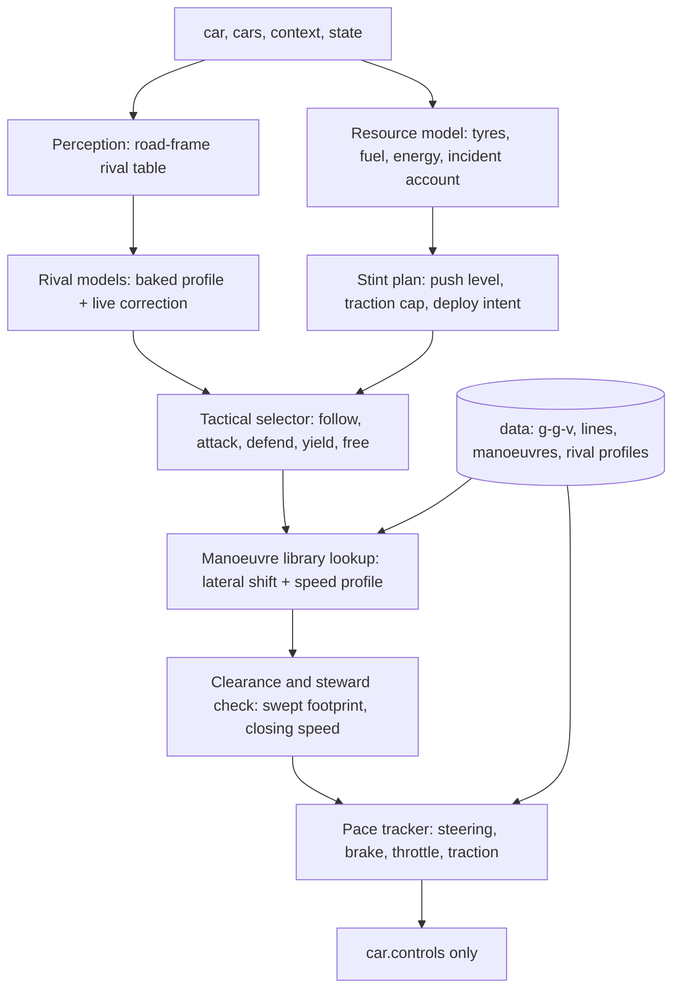

# APEX: a pace-model racer with offline-precomputed racecraft

Status: **design proposal, awaiting owner approval. No driver code exists yet.**
Registered id (planned): `apex`, short `APX`. Built under `subjects/apex/`, a bridge
in `game/bridges/apex-bridge.js` and the minimal registration listed in section 9.
Written after reading `subjects/BRIEF-next-ai.md`, `game/engine/sim/{vehicle,tyre,track}.js`,
`game/core/{stewards,hybrid,race,strategy,pit,rules,difficulty,field,seat-worker,async-seats}.js`,
and the architecture documents and drivers of SPEARHEAD (`next-racer`), SOLSTICE and CLAUDE REVOLUTION.

## 1. What the repo and the physics tell us

### 1.1 Baselines (measured today, solo, medium tyres, difficulty 1, `EnduranceRace`, 12-lap format)

Seconds, lap 1 is a standing start, lap 2 is the first flying lap, a stop (fuel) can land in lap 3
(shown only where it did not). Lower is better. Full table of 30 runs is reproducible with the
sweep script I used (it will be committed as `tools/baseline.mjs` in M1).

| Class | Track | SPH lap1 / lap2 | SLC lap1 / lap2 | CRV lap1 / lap2 |
|---|---|---|---|---|
| GTP | Harbor Ring | 53.97 / **53.82** | 54.56 / 54.76 | 54.28 / 54.48 |
| GTP | Solenne | 52.34 / **51.26** | 53.45 / 51.68 | 53.59 / 52.12 |
| GTP | Alpine | 64.89 / **62.78** | 70.28 / 67.77 | 65.65 / 63.73 |
| GTP | Desert | 69.25 / **67.24** | 73.39 / 70.87 | 69.77 / 67.33 |
| GT3 | Harbor Ring | 63.93 / 63.82 | 63.83 / **63.38** | 63.73 / 64.13 |
| GT3 | Solenne | 62.83 / **61.15** | 63.99 / 61.94 | 64.77 / 63.29 |
| GT3 | Alpine | 76.88 / **74.73** | 82.64 / 80.07 | 78.40 / 76.29 |
| GT3 | Desert | 83.18 / 80.84 | 86.33 / 83.56 | 82.95 / **80.40** |
| GTP | Nürburgring | 463.67 / (stop) | 466.34 / (stop) | 484.01 / (stop) |
| GT3 | Nürburgring | 538.85 / (stop) | 539.46 / (stop) | 630.67 / (stop) |

Reading: SPH is the pace reference almost everywhere; SOLSTICE is within 0.5–1 % on Harbor/Solenne
and much slower on Alpine/Desert; CRV is cheap (1–8 s of wall time per run) but 1–3 % slower.
SPH's cost is 25–140 s of wall time for the same run (SOLSTICE 40–200 s), consistent with the brief's
125–330 ms plan latency. **Pace target for APEX: a flying lap at or under the best number in each row,
and 0.3–1 % under SPH on every track × class by the end of M4.** The Nürburgring flying laps are not yet
measured (the stop lands in lap 2), so M1 starts by recording them.

SPH and SOLSTICE share one executor lineage (SPH's `road.js`/`control.js` are literally derived from
`solstice/src/path.js`), so they have the same line family and force-feedback tracker. APEX therefore
cannot win by tuning the same machine; the pace core below is built independently, and its first
deliverable is a measured per-station gap to SPH's lap (section 4.4).

### 1.2 Physics facts that decide the design

These are read from the code, not assumed.

**Tyre** (`tyre.js`). Grip = `1.48 · f(core−optimum) · g(pressure) · h(load) · wearGrip`.
- `f = 1 − ((core − opt)/105)²`, floored 0.65: 15 °C off the window costs 2 %, 30 °C off costs 8 %.
- `g = 1 − 0.13|p − 2.15|`; pressure follows core temperature by the ideal-gas law from the cold setup
  pressure, so a core 30 °C hot adds roughly 0.25 bar and a further ~3 % loss. Heat hurts twice.
- `wearGrip = 1 − 0.10 w − 1.2 max(0, w−0.72)²`: gentle fade, then a cliff past 72 % wear.
- Force shape is `tanh(slip)` with a 16 % sliding-friction drop after slip 1.4 (slip = hypot(10.5 κ, 8.6 tan α)).
  The force peak sits near a 15–16° slip angle and is *flat*: backing off from the peak to ~9° (shape 0.885 vs 0.953)
  costs ~7 % of force but about halves sliding power. **Sliding power is both the heat input and the wear input**
  (`wear += slipPower · 1.7e-10 · (1 + max(0, surface−115)/35)`), so there is a real price curve between lap time
  and tyre life, and the slope of that curve is something a plan can choose.
- Cooling is convective and grows with speed (`46 + 2.2 v`), so long straights cool the tyres, tight circuits heat them.
  The rear tyres of the driven axle also take wheelspin κ, the known Nürburgring trap. The host's own wheelspin
  limiter (`SPIN_LIMIT`, 0.18) is **skipped for AIs registered with `governor:false`**, so a driver registered like
  SPH/SOLSTICE must police its own traction.

**Aero and slipstream** (`vehicle.js wakes()`). The wake is an exact analytic cone behind each car:
`wake = exp(−behind/55) · (1 − (lat/(2.4+0.05·behind))²)` for 1.5 m < behind < 110 m; the follower gets
`drag × (1 − 0.42 wake)` and `downforce × (1 − 0.16 wake)`. At 8 m behind on the centreline that is −36 % drag and −14 %
downforce, which is worth tens of km/h at the end of a straight (top speed ∝ drag^(−1/3), roughly +15 %) and −7 % cornering speed in
a corner. Because it is a closed form, **a pass can be planned numerically: where to tuck, when to pull out and the corner-speed price of dirty air.**
Staying just outside the cone laterally in corners (cone half-width 2.4 m + 5 % of distance) avoids the downforce loss.

**Collisions and stewards** (`collisions()`, `stewards.js`).
- OBB bodies, half-width 0.98 m, half-length 2.28 m for every class; impulse is proportional to closing speed.
- Incident points: **contact only counts at closing speed > 3.5 m/s (4x to *both* cars); lighter contact scores 0.**
  Off-track is 1x only when the car *centre* is more than `halfWidth + kerb + 1.0` m from the centreline
  (about 9.5 m on Solenne, whose asphalt half-width is 7.4 m), re-armed after 2 s of clean running. Loss of control
  (slip > 1.25 rad above 4 m/s) is 2x, wall contact 2x. Overlapping incidents inside 2.5 s count once at the maximum.
- Drive-through at 17 / 21 / 25 points (≤ 8 / ≤ 14 / longer races), another every 8 points, DQ at `2·limit + 7`.
  Points cost *nothing* below the limit, so the incident budget is a resource to spend deliberately, not a thing to minimise at any price.
- Nothing in the stewards penalises weaving, blocking or squeezing. Contact below 3.5 m/s costs only damage
  (`+0.003 · closing`, which removes 28 % × damage of drive and adds 20 % × damage of drag).
  So "rubbing is fine" is literally true in this ruleset up to a closing speed of about 3 m/s; the line to not cross is 3.5 m/s.
- The kerb is legal and grippy enough: kerb grip 0.88 with a small bump, gravel 0.52, grass 0.42. Existing drivers clamp
  the line to the asphalt envelope (SOLSTICE: "asphalt envelope with footprint margin"). Using the kerb on apex and exit is
  free lap time that the others leave.

**Hybrid** (`hybrid.js`). A 3 MJ store, deploy 20–120 kW by mode, deploy only above 80 % throttle, lift regen 40–130 kW and
brake regen to 300 kW. The *mode* is chosen by the host `aiDeployMode` (attack when a same-class car is < 40 m ahead or < 25 m behind
and charge > 30 %). The driver's only levers today are the throttle (≥ 0.8 to deploy) and where it lifts. The deploy force
`P/v` is 0.14–0.19 g at 50 m/s on a 1030 kg car, which a speed-profile model must include (SOLSTICE copies the observed
`hybridForce`; APEX will model the mode and charge).

**Host loop** (`race.js`, `field.js`, `seat-worker.js`, `async-seats.js`).
- Controllers receive `(car, cars, dt, context)` where `context = { projections, order, totalLaps, mode, time, paceObjective }`.
  Only SPH currently receives an extra `state` (flag, penalty, fuelPerLap, stintLaps, pitPlan, ...), built by
  `nextRacerState` and posted by `AsyncSeats` only when `driver.id === 'next-racer'`.
- Seat workers answer asynchronously; the car holds the last controls until the next reply lands. The driver sees
  snapshots stamped with `context.time`, so the *real* reply delay is observable as the gap between consecutive snapshots.
- Pit entry and exit are driven by a host autopilot; stops, compounds and fuel are decided by the host `TeamStrategist`
  from *measured* fuel burn, wear per lap and the least-squares lap-time slope of the stint. A driver that wears tyres slowly
  and fades little is therefore already rewarded with longer, better planned stints without any host change.

## 2. Thesis: how APEX beats SPEARHEAD

SPH is a careful planner: bounded route families, a 2–3 s horizon, **native `Vehicle` rollouts for admission**, and a safety filter whose
fallback fires 90+ times a race on Harbor. Its own results document says it cannot pass an identical car, defends weakly on the outside,
and fades 5 s over a hard stint. Its weakness is structural: every battle decision costs a rollout, so it decides slowly and conservatively.

APEX attacks the same problem the other way round:

1. **Model once, offline; decide with lookups at run time.** The expensive work (g-g-v model identification, min-time lines with kerb use,
   per-corner attack and defence manoeuvre libraries, rival behaviour profiles) is computed by tools and stored in `data/`. At run time a
   frame costs a handful of table reads and a few dozen scored options. Target: **< 1 ms median, < 3 ms worst, no `Vehicle` rollouts in the hot path.**
2. **Close the model gap per corner.** A predicted-versus-achieved speed log per station drives a learned correction, so the plan the
   driver believes in is the plan the car executes. That is the brief's first requirement and the part SPH leaves as a global margin.
3. **A steward-aware risk model instead of a veto.** SPH treats contact as forbidden, so it yields. APEX prices it: contact below ~2.5 m/s
   closing is nearly free, above 3.5 m/s costs 4 points on both cars plus damage. It takes gaps SPH would not, leans on rivals, and
   still stays under the incident limit by tracking its own incident account.
4. **Know every rival as a deterministic program.** SPH, SOLSTICE, CRV and the rest are code. APEX bakes each architecture's
   speed and line profile per track and class (from their solo telemetry), plus a behaviour flag set (does it yield to overlap, does it defend
   under braking, how late does it brake). A pass is planned against that model, corrected by live observation.
5. **Plan the stint, not the lap.** A three-state tyre model (surface, core, wear) copied from `tyre.js` and a lap model give a per-lap push
   level that minimises stint time under a fade ceiling, rear-temperature ceiling and fuel/energy budget.

Expected sources of advantage, each one a hypothesis with a gate in section 8: kerb use and learned corner margins (solo pace),
exact slipstream exploitation (straights), richer and faster passing options with no rollout latency (combat), lower slip-energy per lap
(fade), and no emergency-fallback braking in traffic (race pace in packs).

## 3. System overview

One owner per decision: perception observes, the resource model budgets, the selector chooses a purpose, the library supplies a path and
speed, the check gates it, the tracker executes it. Nothing writes outside `car.controls`.

## 4. Pace core (milestone M1)

### 4.1 Identified vehicle model (`src/model/`)
A g-g-v envelope per class, built analytically from `car-specs`, `tyreGrip` and the aero closed forms (including platform and wake factors), with
live inputs: compound optimum, core temperature, pressure, wear, fuel mass, damage, wetness, wake, and, for GTP, the hybrid mode and charge.
`tools/identify.mjs` runs the real `Vehicle` in steady-state circles, brake tests and flat-out accelerations at several speeds and fuel loads and
records the model error. **Gate: lateral, braking and drive limits within 2 % of the simulator, lap time predicted within 0.5 % of the lap the car then drives.**

### 4.2 Minimum-time line with kerb use (`tools/bake-lines.mjs`, `data/lines.json`)
Lateral offset q(s) on 2–3 m stations. A quasi-steady-state lap solver (curvature, g-g-v speed, forward/backward passes) evaluates lap time; q is
optimised by projected gradient with a smoothness prior. The road bounds include the kerb up to a configurable depth with the 0.88 grip and bump
penalty modelled, and a hard cap at `halfWidth + kerb − 0.3 m` for the car centre so the stewards' off-track rule (+1.0 m) keeps a margin.
Baked per track × class × compound-family; a coarse-to-fine **runtime fallback** builds a line on a 15–20 m grid when no baked line exists
(unknown track, adaptability requirement). Nürburgring (25 km, 12 m road) gets its own bake because its curved braking zones cut off
the short-chord assumptions the other circuits tolerate.

### 4.3 Tracker (`src/tracker.js`)
- Steering: path-curvature feedforward from the identified understeer gradient, plus lateral-error, heading-error, yaw-rate and sideslip feedback
  with gains scheduled by speed. Bandwidth is set from the measured reply delay so the same code is stable in lockstep (1/120 s) and in a seat worker
  (typically 20–60 ms, bursts to 75 ms), and the controller predicts its own pose forward by that delay before computing the command.
- Longitudinal: speed-profile preview with trail braking along the friction circle (brake demand reduced as lateral demand rises), brake
  release shaped to the tyre peak, ABS-aware.
- Traction: drive-axle slip target (κ about 0.18, lowered when the rear core exceeds its ceiling), which is the lever for the Nürburgring rear-overheat trap.
- Gear: the host automatic box is left alone.

### 4.4 Per-corner gap measurement and learning
Every lap the driver logs, per 5 m bin, the planned speed, achieved speed, peak tyre utilisation and slip margin. `tools/learn.mjs` runs long
solo stints, and writes a margin factor m(s) into `data/margins.json`; the same learner runs online at a small gain to absorb tyre and fuel drift.
`tools/gap.mjs` overlays APEX's speed trace against SPH's best lap by station and prints the corners where SPH is faster, which is the work list
for M1. **Gate for leaving M1: flying lap ≤ the best baseline in section 1.1 on every track × class, zero incidents over 5 laps.**
If the identified model shows no headroom over SPH on some circuit, that is reported honestly in `RESULTS.md` and the pace target there is "match"
while the other levers carry the race.

## 5. Awareness and rival models (M2)

### 5.1 Perception (`src/perception.js`)
A fixed-size table, updated each call, for every car within 250 m of arc length and any car faster than us approaching from behind:
road-frame position (s, lateral), speed, longitudinal and lateral acceleration (filtered on the snapshot timestamps, not the capped `dt`),
yaw, oriented footprint, class, closing rate, time gap, wake relation (inside/outside the cone, tow value), overlap state (ahead, alongside-front,
alongside, alongside-rear, behind), pit and ghost status, laps down. Reset on teleport, recovery or session change. Alongside is a state, not an
"ahead" or "behind", since flipping between them was a known source of steering swing.

### 5.2 Baked rival profiles (`tools/rival-profile.mjs`, `data/rivals/`)
For each architecture × class × track: a speed-versus-station curve (solo flying lap), lateral-line curve, braking points and a behaviour record:
yield-to-overlap tendency, defence timing, and brake-point lateness. Rivals are identified through a read-only roster field in `state` (the roster
is public on the timing screen; see P3). The live model starts from the baked profile and blends toward observation (offset, speed, tyre-driven pace
change), so it still works for an unknown or modified opponent. Equal copies of APEX use the pair id for deterministic role splitting so two APEX
cars race each other cleanly.

### 5.3 Predicted occupancy
Each rival yields a small set of candidate futures (profile, brake early, cover inside, drift wide) with probabilities updated from observed motion.
They are scored separately, not unioned into one huge obstacle, and always include the "does the worst thing" branch for collision gating.

## 6. Combat (M2)

### 6.1 Precomputed manoeuvre library (`tools/bake-manoeuvres.mjs`, `data/manoeuvres.json`)
Per corner (found from the baked line's curvature, entry/apex/exit gates discovered, not hard-coded) and per class, the tool builds and stores,
as lateral-shift profiles over the baked line with their own speed profile from the g-g-v model:

| Role | Options |
|---|---|
| Attack | late-brake inside dive, outside carry-speed, cutback (wide entry, late apex), tow-and-pull on straights, switch before the brake zone, kerb-hop squeeze |
| Defend | inside cover, mirror move, late line-hold, outside-line defence with exit priority |

Each entry stores: time and exit-speed cost versus the racing line, minimum required initial gap/overlap, the station where it commits,
lateral rate at every point (so it is physically trackable), and the clearance it needs next to a rival body. At run time choosing a manoeuvre is a lookup
over the nearest few corners, never a search or a rollout.

### 6.2 Tactical selector (`src/tactics.js`)
States: FREE, FOLLOW (tow-optimised gap), SETUP, COMMIT, ALONGSIDE, DEFEND, YIELD (blue-flag and multiclass), RECOVER. Each candidate is scored in
seconds: predicted exit-gap delta (positions are worth the time to the next rival), plus expected incident cost, plus tyre-energy cost.
**Incident cost is `P(contact > 3.5 m/s) × (points × exchange rate + damage + time loss)` where the exchange rate rises as our incident account approaches the
penalty limit**, so early in a race the car is bolder and near the limit it is not. Contact below ~2.5 m/s closing is priced at damage only.
Commitment is tied to stations (brake point, turn-in, apex), and once alongside the occupied side is never crossed: the car holds its width or backs out only
if the pass is already lost. A failed side is remembered for a corner or two; a repeated no-gain episode switches to the complementary route.
- Squeeze and elbow: when side by side into a corner and the rival model says it yields, the car keeps its line and its body position (light contact is free);
  the rival's response then decides who gets the apex. The model never closes a door on a car already alongside.
- Defence is one decisive move per straight, not a weave; the stewards do not penalise it, but unpredictable movement is a collision risk.
- Multiclass: GTP chooses the side the GT3 car is not on and passes on straights where it has the tow; GT3 holds a predictable line and eases aside
  on a blue flag only when overlap is imminent (no gratuitous lifting).
- Starts: launch-control throttle/slip schedule and a first-corner policy that takes gaps rather than waiting for a clean lane (the rolling-start handover blends
  from the formation pilot's controls).

### 6.3 Clearance and steward gate (`src/safety.js`)
Analytic swept-footprint check of the chosen path and speed against the predicted rival branches over the next 1.0–1.5 s, in road coordinates; closing speed at any predicted
contact is computed and compared with 2.5/3.5 m/s. A failed check does not disable the whole pace plan; it picks the next manoeuvre or follows. Hard rules the gate
enforces: never steer into a car that is alongside; never leave the kerb margin; after any off or spin the account is updated and the risk appetite drops.
The emergency fallback is counted as a metric (SPH: 90+ per Harbor race; APEX target < 10).

## 7. Stint, resources and strategy (M3)

### 7.1 Stint plan (`src/stint.js`)
- **State model:** the tyre equations of `tyre.js` for surface, core, pressure and wear per wheel, driven by slip power estimated from the lap model
  (front/rear split, braking, cornering and traction contributions per station), plus fuel mass and hybrid charge.
- **Decision variable:** a push level u ∈ [0.90, 1.0] scaling the corner-speed margin and traction slip target per lap (and a separate rear-traction factor).
  The planner finds the u sequence minimising total stint time subject to: maximum fade ≤ 4 s (best flying lap to the last before the in-lap), end-of-stint wear below the
  cliff with margin, rear core below its ceiling, and the fuel/energy needed to the planned stop (host `pitPlan` when known, else inferred from fuel burn).
  Dynamic programming over laps on a coarse (u, core, wear) grid; per-lap cost from a table of lap time and slip energy against u that `tools/stint-table.mjs` bakes per
  track × class × compound. Re-solved every lap against the measured state; correction from measured wear/temperature rather than from the forecast.
- **Compound and temperature:** the planner knows each compound's optimum (82/90/99 °C), so it aims core temperature at the optimum early in the stint (warm-up laps are
  deliberately pushed in the right places) and decays pace smoothly rather than holding full push until the cliff.
- **Fuel:** weight at 0.75 kg/L is about 3 % of GT3 mass at a full 60 L tank; the model lowers speed targets automatically as fuel burns, so lap times *fall* along a clean stint
  until tyre fade overtakes the fuel gain. Lift-and-coast is available when the host asks the team to save fuel.
- **Hybrid (GTP):** deploy and regen are in the lap model (mode and charge observed from `car.hybrid`). Without new host API the lever is where to lift and brake; with approved
  P2 the driver chooses the deploy mode per station.
- **Weather and damage:** wetness lowers the g-g-v and re-bases the plan; damage lowers power and raises drag in the model, and the car pits for repair when the host calls the meatball.

### 7.2 Pit and strategy
Pit entry and exit stay host-owned (`PitAutopilot`); APEX plans the approach so the stop is not preceded by a slow lap (push the in-lap, brake into the lane at the limiter) and
prepares its own cold-tyre out-lap (tyre temperature is back in the window within ~1.5 laps by planned slip). With approved P1, APEX also owns the box call and compound. Without it, the host
strategist plans from APEX's measured wear and fade, which is already favourable.

## 8. Real-time budget, determinism and verification

- **Cost:** no rollouts; perception O(N) with N ≤ 20, table lookups, ≤ 16 scored options. Budget gates are enforced in `tools/worker-probe.mjs`:
  median < 1 ms, p99 < 3 ms per update on this machine, and a per-frame answer in seat workers at 30 and 60 Hz posting with 75 ms bursts.
- **Determinism:** no `Date.now`, `performance.now` or `Math.random` in decisions; all tie-breaking uses car and corner ids. Benchmarks are seeded. Timing is measured only by tools.
- **Safety nets:** stall and wrong-way recovery (including reverse), spin recovery, guard against non-finite controls in the bridge, fallback to hold-line on any thrown error.
- **Rules compliance:** writes only `car.controls`; no `process.env` in `src/`; no change to other AIs or shared physics, track data or rules.

### Benchmark protocol (what `RESULTS.md` will record after every milestone)
1. Solo pace per track × class versus SPH and SOLSTICE (and CRV): best and average of 5 flying laps, incidents.
2. Duels versus SPH: both grid orders × 5 tracks × 2 classes, rolling start; wins, margin at the flag, contacts, incident points, passes.
3. Eight-car multiclass races and 12-lap endurance races with stops: finishing order, incidents, penalties, stint fade; several seeds.
4. Real-time seat-worker conditions with delayed replies and bursts, not only lockstep.
5. Per-update cost distribution.

### Acceptance gates (overall)
| Area | Gate |
|---|---|
| Solo pace | ≤ best of SPH/SOLSTICE/CRV on every track × class; target −0.3 to −1 % vs SPH |
| Stint | ≤ 4.0 s fade before the in-lap on every track × class (SPH: 5.0 s on a hard stint) |
| Duels vs SPH | win ≥ 60 % of the 20 pairings (grid order, track, class); zero heavy contacts (> 3.5 m/s) and no penalty, incident points ≤ 4x per race |
| Races | beats SPH in finishing order in ≥ 70 % of seeded 8-car and endurance races; no race ends with a penalty or DQ |
| Real time | median < 1 ms, p99 < 3 ms; reply in one frame; results match lockstep within noise |
| Emergency fallback | < 10 fires per Harbor race |

## 9. Registration and wiring (the only touched shared files)

| File | Change | Why |
|---|---|---|
| `game/bridges/apex-bridge.js` (new) | bridge as `revolution-bridge.js`, controls validated, safe-stop on error | wiring |
| `game/core/teams.js` | add `{ id: 'apex', name: 'APEX', short: 'APX', arch: '…', anyTrack: true, manage: false, governor: false }` | roster |
| `game/core/classes.js` | add `'apex'` to the GTP pool | prototype-capable AI |
| `game/core/field.js` | `case 'apex'` in `createSeatBridge` | seat factory |
| `game/core/async-seats.js` (optional, P3) | post a read-only `state` for `apex` as it already does for `next-racer` | seat-worker context |

No other AI, physics, track, rules, stewards or strategy file is changed.

## 10. Proposals that need the owner's approval (nothing is built on them until approved)

| # | Proposal | Value | If rejected |
|---|---|---|---|
| P1 | Let APEX own the pit call/compound/fuel through a strategist subclass (the way `installNativeStrategy` does for SPH) | Pit timing and compound tuned to measured stint model; likely worth one position in a stop race | Host strategist plans from APEX's measured wear and fade |
| P2 | `car.intent = { deploy }` honoured by `aiDeployMode` within the existing energy rules (same proposal made by CRV) | Deploy where it saves the most time (low-speed exits) and for passes; GTP only | APEX models the host's mode and only controls lifts and throttle |
| P3 | Extend `AsyncSeats.post` to send a read-only `state` to APEX (flag, penalty, own incident points and limit, fuel/stint, pit plan, roster ids of rivals) via a generalisation of `nextRacerState` | Needed for the incident account, rival identification and pit awareness inside seat workers | APEX infers fuel, stint and pit from the car; rivals are identified only by observed behaviour; no incident account (conservative risk default) |

I recommend approving P3 at least; it is read-only, mirrors an existing mechanism and is what makes the risk model and rival identification work in the real game.

## 11. Milestones

| # | Content | Exit gate (recorded in RESULTS.md) |
|---|---|---|
| M0 | Registration skeleton, fixed-pace bridge stub, `tools/baseline.mjs` (flying laps for SPH/SLC/CRV including Nürburgring) | Baseline table complete, bridge loads in lockstep and worker |
| M1 | **Pace core**: model identification, baked lines with kerb, tracker, margin learning, worker-safe delay handling | Solo gates, 5 tracks × 2 classes, zero incidents |
| M2 | **Combat**: perception, rival profiles, manoeuvre library, tactics, safety gate, start | Duel gates vs SPH both orders; contacts and incident gates; fallback count |
| M3 | **Stint/strategy**: stint plan, rear-temperature control, fuel and hybrid model, pit approach/out-lap (P1/P2 if approved) | Fade ≤ 4 s, 12-lap endurance with stops, beats SPH across seeds |
| M4 | **Tuning**: per-track parameter sweep within the baked data, multi-seed regression, real-time worker runs, tuning only against held-out seeds | All overall gates, full report |

Each milestone is committed in small steps, with `RESULTS.md` updated and the run commands recorded.

## 12. Risks

- **Pace headroom may be smaller than hoped.** SPH is already near its lap; the first M1 deliverable measures the headroom (model QSS lap versus SPH's actual) before the line work is sized. Fall-back: match pace, win by combat and stint.
- **Offline data goes stale** if physics change. Mitigation: bake tools are one command per track, and a hash of the physics constants is stored with the data and checked at load, falling back to the runtime solver on a mismatch.
- **Risk model could be too bold** and trigger penalties in long races. Mitigation: the incident account hard-caps spending at ~60 % of the penalty limit; stress runs with many seeds before any claim.
- **Rival profiles overfit** to today's rival versions. Mitigation: the live correction and behavioural fallback, plus profiles are data, not code, and rebuilt by a tool.
- **Wall-clock cost of bakes.** Nürburgring's 25 km line and manoeuvre library may take minutes offline; acceptable, runtime stays cheap.
- **Branch.** Development is on `claude/apex-ai-driver-8me8r0`, the branch assigned to this session, not a branch literally named `apex`; I can rename or push a second branch on request.
