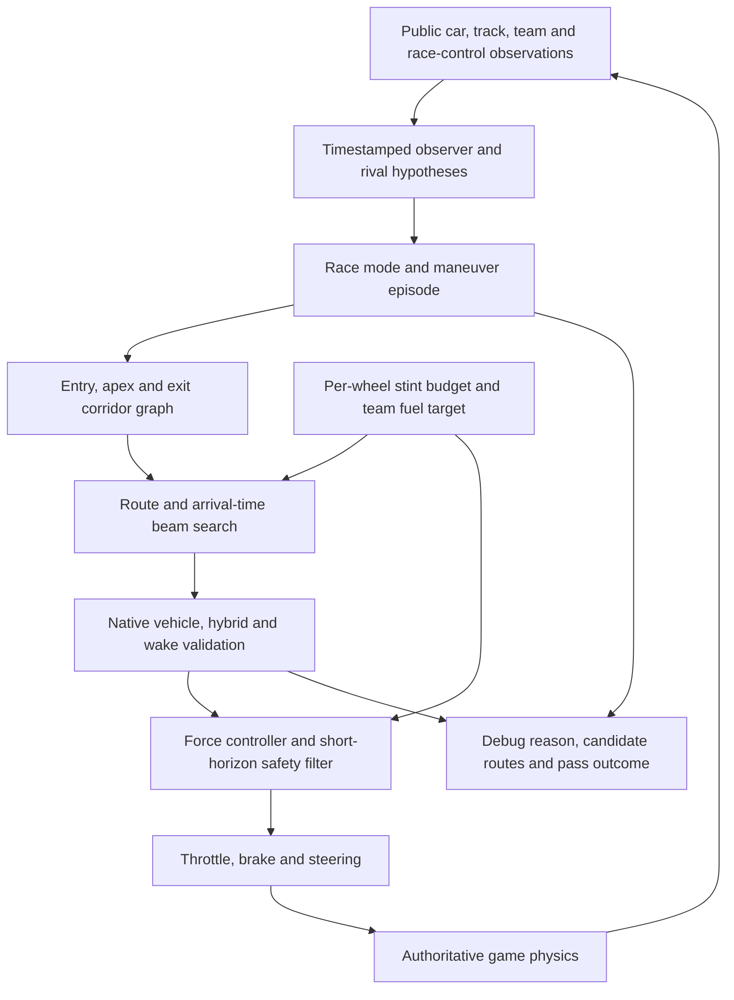
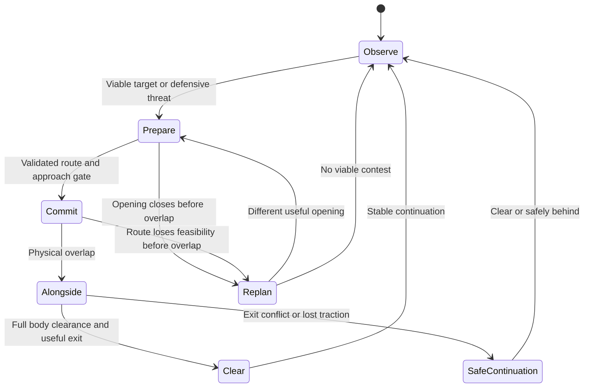

# A maneuver-first GTP racer

Status: design target with an implemented experimental runtime, **SPEARHEAD**,
registered as `next-racer`. Grounded in the [game audit](GAME-AUDIT.md) at commit
`ea7b402`. It is a separate subject and preserves SOLSTICE. The runtime currently
uses bounded route families and a coarse whole-maneuver forecast followed by
native prefix validation. This document's full corridor graph, rival-response
coverage and acceptance requirements are not claimed complete; see
[results](RESULTS.md) and [pass attribution](ATTRIBUTION.md).

## Objective and order of work

Build a racer that chooses a useful route around other cars, commits to a
feasible pass, accelerates through its exit and defends without parking itself
on the opponent's line. GTP is the primary class; GT3 uses the same tactical
architecture with its own physical model and resource budgets.

The Harbor Ring targets are GTP **<53.0 s**, GT3 **<64.0 s**, and **≤4.0 s maximum
fade before the planned pit window**. These are later acceptance gates. First
prove overtaking, defense, safe alongside running, multi-car awareness and
worker integration at a stable reference pace. Do not spend the development
budget extracting the last second from a solo line while those capabilities
are missing. A fast lap does not waive a combat failure.

## Why a separate architecture

SOLSTICE already has useful strengths: per-class periodic geometry, live
per-wheel force feasibility, native vehicle rollouts, bounded recovery,
alternate passing offsets and clean measured GT3 duels. Preserve it as the
reference and fallback choice for the user, rather than destabilizing its
winning human/AI stint behavior.

The remaining limitation is not simply an aggression multiplier:

- Its detailed horizon is 1.1 s. The scored terminal continuation adds a blocked
  lane cost, but does not solve an entire outside-entry/cutback/exit maneuver.
- Its main alternatives are bounds/offsets or a held road lane around periodic
  geometry. They offer useful passing corridors but not a rich entry-apex-exit
  route and arrival-time search.
- Rivals are projected mainly from filtered longitudinal acceleration and
  lateral motion. Their reaction to an attack is not explicitly branched.
- Wake is retained from the current observation during a rollout. Hybrid thrust
  is copied without the new native energy/regen transitions.
- The control interface loses some session, thermal and team context in the
  browser worker. More sophistication inside that incomplete interface would
  still make wrong predictions.

Sources: SOLSTICE [driver.js](../solstice/src/driver.js), lines 202–320;
[traffic.js](../solstice/src/traffic.js), lines 108–158 and 186–203;
[plant.js](../solstice/src/plant.js), lines 19–38. These are structural findings,
not a claim that every observed hesitation has the same cause.

## Proposed stack



There is one owner for each decision. The observer estimates what is happening;
the maneuver manager chooses the tactical purpose; the route planner chooses a
path and timing; native validation confirms executable motion; the controller
tracks it. The safety filter can veto immediate danger but cannot silently turn
every nearby rival into a global speed limit.

## 1. Timestamped observer and opponent hypotheses

Normalize every snapshot into one immutable observation:

```text
Observation = {
  epoch, sourceSeq, sourceTime, observationInterval, expectedActuationDelay,
  self: { motion, actuators, wheels, resources, class, progress },
  road: { geometryHash, surfaces, currentRubber, wetness, tempGrip, ambient },
  session: { kind, phase, qualifyingPhase, formationOwned, preview, totalLaps, lapsLeft },
  team: { activeSeat, fuelPerLap, stintLaps, pitPlan, pitPhase },
  raceControl: { ownFlag, ownPenalty, ownIncidents, publicHazards },
  rivals: [{ publicMotion, class, progress, ghost, pitStatus, finished }]
}
```

This is a proposed adapter contract, not information already present in every
worker. Fields use current/public observations. No future weather RNG state,
opponent controller plan or privileged internal strategist state is permitted.

Unwrap track distance independently from race progress. Physical distance tells
us who can collide; progress/class tells us who is contesting a position or
lapping. Predict the opponent's public chassis footprint, not just its center
or a hard-coded length from GT3. A single ghost remains a possible physical
obstacle under the current collision rule; two ghosts do not collide.

For each relevant rival retain a short history of pose, road-relative velocity,
yaw, acceleration, turn-in and recent lane choices. Use timestamp differences,
not the capped worker `dt`, for inference. Reset history after a teleport,
marshal recovery, class/session change or long discontinuity.

Generate a small, evidence-weighted set of rival responses:

| Hypothesis | Evidence | Tactical use |
|---|---|---|
| Continue current route | Stable lateral motion and heading | Draft/pull-out prediction |
| Cover the approach inside | Early lateral move before braking | Outside pass or cutback |
| Return toward the exit | Unwinding yaw after apex | Avoid premature lane reclamation |
| Brake/lose traction | Measured deceleration/slip or cold/worn state | Closing and dive viability |
| Cross/rejoin/stall | Inconsistent heading, off-road pose, low speed | Immediate robust avoidance |

These are bounded predictions, not assumptions that the opponent will cooperate.
Only public motion updates their probabilities. The opponent's AI name must not
substitute for observed behavior.

Near-term occupancy must include physically credible motion alternatives and
measurement/latency error. Longer-term scoring compares separate response
branches; it must not merge every possible future lane into one ever-widening
obstacle that blocks the entire road. Behind and alongside cars constrain
reachable space; proximity by itself does not justify braking.

## 2. Maneuver episodes and commitment

Separate race modes from battle stages. Race modes include GRID/PRIME,
FORMATION_OWNED, FORMATION_PREVIEW, QUALIFY_OUT, QUALIFY_PUSH, RACE,
PIT_APPROACH, PIT_OWNED, REJOIN, RECOVER and
FINISHED. A held countdown or service stop is not a stall.

Within RACE, use an episode with these stages:



An episode records the target, attacking/defending role, passing side,
topology, gate sequence, expected exit advantage, commitment station, failed
alternatives and an explicit reason for any abort. It does not merely latch
`ATTACK` because an opponent is nearby.

Before overlap, switch to an alternative when the current opening shuts. Once
alongside, preserve the occupied side and the neighbor's space. A plan's expiry
cannot command a crossing back through a car. Release commitment only when the
bodies and the exit continuation are clear, not when our nose briefly leads.

Commitment is tied to approach/apex/exit stations and measured feasibility,
with time limits as a fallback. This avoids both rapid indecision and a long
blind side hold. A failed maneuver changes the next route hypothesis: an
inside cover should generate an outside/cutback attempt, not repeated diving
into the same closed corridor.

Detect a deadlock when a repeated episode loses time without closing or gaining
useful overlap. Evaluate the complementary route or prepare the next corner;
otherwise return to efficient following until a genuinely new opportunity.
Do not indefinitely alternate sides or crawl behind the same hot-lap line.

Equal copies have distinct roles from their physical order: the leader defends,
the follower evaluates how to beat that defense. Deterministic, role-aware
tie-breaking can vary equally good routes using public pair IDs and corner
index. It never selects an unsafe or worse route just to appear creative.

## 3. A corridor graph over complete maneuvers

Build a road-coordinate map with arc length, signed road curvature, surface
bands, legal boundary, wall/pit masks and entry/apex/exit gates. Discover gates
from native geometry and feasible speed changes. Harbor's named sections aid
inspection; fixed station numbers must not be the algorithm.

At each gate, represent several **regions and arrival states**, not a few fixed
offsets around one hot-lap line:

```text
GateNode = {
  station, lateralInterval, headingInterval,
  speedInterval, arrivalTimeInterval,
  neighborOrdering, surfaceBand, terminalContinuation
}
```

Generate edges anchored to the car's actual pose, velocity and steering state.
Use continuous path derivatives and achievable lateral/yaw response. A smooth
polynomial on paper is not enough: its curvature, braking demand, slip and full
footprint must remain executable. Never restart a transfer from the nominal
line when the car is already moving laterally.

Required maneuver families:

| Situation | Routes that must compete |
|---|---|
| Rival sits on our straight line | Tow then pull left/right; early separation; efficient follow |
| Gentle curve | Parallel inside/outside routes with their own speed/exit states |
| Heavy-braking entry | Valid late-braking inside route; outside carry; exit-focused cutback |
| Defender covers inside | Outside entry, delayed apex and inside exit if body clearance permits |
| Alternating bends | Outside of the first to claim inside of the second |
| Already alongside | Two legal side-by-side corridors through apex and exit |
| Queue or three cars | Pass one side, split only with real room, follow/prepare another gate |
| Faster class approaching | Stable yielding corridor without abrupt braking or lateral jumps |

Each topology includes a longitudinal schedule. A wide entry may deliberately
delay arrival to gain a better exit. An inside dive must include the throttle
and curvature required to **finish the pass**, not only reach the apex first.

Use a bounded beam over the next meaningful overtaking exit, normally one or two
linked corners (roughly 3–8 seconds, at most about 450 m as an initial compute
budget). When catch time exceeds that horizon, PREPARE should improve closing
and future positioning instead of claiming an immediate pass. Longer scenarios
and successive episodes are still necessary in tests.

The periodic fast line is a warm start and the free-air default. In a battle it
is one candidate among many and has no privileged lateral attraction cost.
Returning to it must be physically clear and useful for the next corner.

## 4. Outcome-based planning

Do not rank a maneuver only by distance covered in its first second. Evaluate
the route through its exit under a small set of credible rival responses.

Use this decision hierarchy:

1. Reject physical body conflicts, illegal road/wall paths and unrecoverable
   terminal speed/yaw/tyre states. Do not permit a faster score to buy contact.
2. Require a feasible continuation under actuator delay and current grip.
3. In ATTACK, reward full pass completion and sustained relative advantage at
   the exit, accounting for the time and resource cost needed to achieve it.
4. In DEFEND, retain position with one legal covering move and a useful exit,
   subject to a strict sector-time loss budget.
5. Among useful routes, minimize expected race time and resource consumption;
   prefer continuity when differences are smaller than model uncertainty.

Report component costs in understandable units: seconds to the exit, predicted
exit gap in meters, collision/road feasibility, reserve slip work and expected
post-exit recovery time. Calibrate tactical bonuses from measured outcomes.
Do not hide conflicting goals in arbitrary coefficients with incompatible units.

Evaluate defense against the same starting-state free-air continuation. It
must not win by slowing both cars while a third car closes. Start with a
3% defended-sector time-loss ceiling and ≥95% of feasible free exit speed,
then test those budgets. There is no reward for blocking by stopping. If keeping
the position requires that loss or forcing a car off track, choose the best
legal exit and a counterattack instead.

Full-throttle intent is authorized once the selected path has lateral/body room
and axle force capacity. An adjacent car does not inherit the leader-following
cap. Reduce longitudinal demand for a real interception, overspeed or traction
constraint; record which one caused the change. Positive throttle is not proof
of commitment unless measured acceleration and relative progress follow it.

## 5. Two levels of prediction

Long tactical search uses a cheap, calibrated class-specific motion model and
surface/force envelope. It keeps route diversity and predicts arrival-time,
energy and tyre-work ranges. It is not trusted alone to issue controls.

For the best few **different topologies**, validate a near-term prefix with the
actual game `Vehicle`, deep private wheels/resources, native `hybridStep()`,
native deployment policy and wakes reconstructed from predicted rivals. Retain
current steering, automatic gearbox, RPM, shift timer, heave/pitch, tyre slip,
pressure, load, damage, fuel scale and energy. Recompute a terminal reachable
set that can brake and continue through the remaining gates.

Native forecast order matches the game: candidate controls → applicable cloned
governor → cloned host deployment policy → hybrid step → wake → vehicle step.
The host's current gaps and qualifying rule are replicated, including their
present limitations. Do not add extra braking for brake regeneration; native
lift regeneration already modifies axle thrust.

Predicted motion uses a read-only environment facade. Imagined tyre work cannot
deposit real rubber, imagined impacts cannot alter live cars and no forecast
can alias the real energy/tyre objects. Verify both state equality and reference
independence. Rival forecasts need only public state and learned response bounds.

Use near-native temporal resolution for the immediate prefix and swept-body
checks between samples. Coarser tactical steps may miss fast lateral contact;
they require conservative sweep bounds. A false assumption that an already
leading car's rear is clear must not bypass SAT checks.

An initial implementation budget is 12–24 cheap route seeds, a beam of 4–6
topologies and native validation of at most 3–4 distinct prefixes. These are
starting engineering budgets, not measured performance claims. If the budget
fails, reduce redundant samples/cache envelopes; do not discard the opposite
passing side solely because a wall clock expired.

## 6. Feedback execution and safety

Use an axle-force controller with combined-slip allocation, steering/yaw and
body-slip feedback, trajectory curvature feed-forward and the native actuator
response. Braking, rotation and drive must share available front/rear grip.
Hybrid adds rear drive or lift drag, so the throttle calculation includes it.
TC and ABS remain the game's systems; no live setup changes are needed.

The safety filter validates a short reachable tube under the expected held
control duration. Its interventions are classified as collision, road/wall,
grip/stability or stale observation. Select steering/drive alternatives before
using braking when a lateral route remains safely executable. A very close
but receding rear car must not cause an unnecessary lift.

If every feasible prefix conflicts with a current obstacle, braking or yielding
is necessary. Assert it has a finite progress-recovery route and a reason; do
not claim contact-free operation means successful racing if it produces a queue.

Recovery checks road clearance before a turn or reverse, then rejoins at a
predictable angle and speed. A paused race, countdown, pit service and finished
car use separate modes. Clear episode/history after host rescue, reset or a
manual-to-AI handover; reconstruct from current state rather than stale controls.

## 7. Per-wheel stint budgeting

Keep four thermal/wear histories and forecast each wheel's remaining budget to
the team's pit window. Convert slip power to native surface/core/wear changes;
use compound-specific optimum, pressure, class wear multiplier, ambient,
wetness and load. Fit model residuals from actual observations without changing
the native equations or granting hidden grip.

An attack spends a bounded amount of longitudinal/lateral slip work for a
measured expected time gain. A failed repeated attack must stop spending that
budget. Price the most stressed rear wheel more strongly before its wear cliff;
protect it through steering shape, earlier unwinding and axle torque allocation
rather than uniformly slowing the entire lap. Forecast stable hybrid charge
across the stint so an initial charged lap does not disguise energy fade.

Additional deliberate rear rotation is an optional trajectory/control candidate
only when the **same rear tyre** is above its own optimum +4°C **and** has wear
>0.12. Even then it must improve the exit and fit the remaining slip-work budget.
Warmth alone, wear alone or using temperature from one wheel and wear from
another do not enable it. This rule carries the user's intended behavior into
the new subject while leaving SOLSTICE's existing gate intact.

Consume the team's fuel-per-lap target and actual pit plan. Use control timing,
efficient following and limited lift/coast when required; the gearbox remains
automatic. Driver swaps, mandatory service and stop loss belong to the native
team strategy. Any future strategist extension is a separate integration change,
not an unreviewed way to satisfy the fade target with extra stops.

The four-second limit is measured over the declared planned stint, on a fixed
weather condition for the degradation gate. Report native operational lap
spread as well as attribution to tyres, charge, fuel mass and traffic. Weather
changes are separate robustness scenarios, not mislabeled tyre degradation.

## 8. Full game integration

| System | New driver behavior / hook |
|---|---|
| Teams and co-driver selection | Separate roster ID; normal active/inactive seats and swaps |
| GTP class assignment | Add ID to capability allowlist and correct its display metadata |
| Seat factory and worker | New bridge; optional observation envelope available locally and remotely |
| Countdown | Prime launch controls without advancing stall timers or an episode |
| Rolling formation | Respect autopilot ownership, prepare after its reset, ignore duplicate-time integration and release cleanly at green |
| Qualifying | Out-lap preparation, then clean timed laps; disregard mutually ghosted traffic |
| Race control | Consume actual flags/hazards; no defending against lapping traffic or pit-owned cars |
| Yellow hazard | Avoid the actual hazard with a stable legal route; do not invent a global yellow speed cap |
| Blue / faster class | Preserve a predictable lane and space for the pass; no abrupt stop/swerve |
| Pit approach | Plan the real approach with cold/wet/worn grip and host handover/blend |
| Pit service/release | Let autopilot own the car; rebuild at reset and verify rejoin body clearance |
| Damage/penalty | Follow host box calls; no competing maneuver across the pit path |
| Difficulty | Keep existing per-driver policy; below Alien difficulty must still affect the AI |
| Hybrid | Observe live store/dial; predict native host mode; write controls only |
| Weather and day/night | Use current grip/rubber/ambient; log actual seed/clock for reproduction |
| Career/results | Produce native clean results; never write rating, timing or steward state |
| B debugger / aim point | Emit stage, target, topology, rejected alternatives, speed and tracking point |
| Headless / legacy offload | Same observation semantics; register a separate factory where applicable |

Proposed implementation edits are isolated to `subjects/next-racer/`, its new
bridge, roster/factory/class registrations and **explicitly scoped optional
adapter data forwarding**. Existing SOLSTICE and other AI files remain unchanged.
The optional adapter work exceeds the original registration-only exception and
must be scoped before implementation; this proposal does not apply it.

The game already supports `manage: false` and `governor: false` per roster entry,
with a bypass only at Alien. Decide the new entry's policy during integration
after its resource controller is validated. Do not change the global governor,
pace reference, physics, tyre compounds or strategist to manufacture results.
Measure requested controls separately from controls actually applied by the
host so a cap is never mistaken for hesitation inside the driver.

## 9. Scheduling and actual workers

Start with perception/control/safety on every delivered observation, tactical
planning at 5–10 Hz when contested, and resource/envelope updates at 2–3 Hz or
on meaningful state changes. Avoid copying full-lap geometry on every message.
Warm-start within a topology, but retain a different topology in the beam.

Reserve time for safety and a valid reply. Break longer tactical work into bounded
batches; cache unchanging geometry and surface envelopes. When a deadline is
missed, use a validated incumbent route for its finite validity interval and
stop optional search. Do not send a partially checked candidate.

Worker output should carry its epoch, source sequence/time and validity horizon.
The host must reject stale replies after reset/swap and know when held controls
outlive validation. A driver-specific minimal host guard for that condition is
an integration proposal, not an existing capability. It must leave other AIs'
behavior unchanged and must not introduce a blanket race speed cap.

During rolling-start preview the host overwrites prepared driver inputs. Do not
learn grip/actuator residuals from the mismatch or start overtaking before green.
Treat a duplicate timestamp as the same observation; it may need a fresh control
reply after ownership changes, but it must not consume a second time step or
double-count thermal/resource work.

Measure p50/p95/p99 controller time, serialization, round-trip latency, control
age, overrun rate and CPU seconds per simulated car-second. Initial budget:
≤0.15 CPU s per simulated car-second, p95 update ≤8 ms and no routine >20 ms
tasks on the reference machine. These are targets to be calibrated against
actual laptop/field load, not guarantees from this design.

Held 20/30/60 Hz native fixtures are useful but insufficient. Actual browser
workers, debug enabled/disabled, variable frame durations, burst delays, driver
swaps and rain must pass. A controller that works only synchronously at 120 Hz
is not accepted.

## 10. What to learn from the current competitors

| Driver | Useful mechanism | What the new architecture changes |
|---|---|---|
| Phantom v1/v2 | Native plant sampling, world-space body prediction; v2 learns public rival lines | Score a complete maneuver/exit instead of principally ghost-relative progress; bounded route diversity instead of a large undirected control sample pool |
| Gemini v4 | Cheap whole-lap line/envelope and traffic bands; optional tow/cutback/two-corner hooks | Validate complete coupled routes and longitudinal schedules under native physics, not only offset choice and a follow cap |
| Solinator 6.1 | Physical arrival gates, two-stage transfers, explicit braking alternatives | Expand from a small lateral-port beam to corner-relative route regions, response branches and pass-completion terminal states |
| Astra | Maneuver memory, attack episodes, prediction diagnostics and continuation checks | Retain memory/diagnostics but require contact-free native validation and momentum-preserving outcome scoring |
| SOLSTICE | Fast clean baseline, class geometry, per-wheel force control and alternate lanes | Replace the line-centered short battle search; model evolving hybrid/wake and complete approach-to-exit episodes |
| CLAUDE REVOLUTION proposal | Corner opportunity map, rival profiles and planned-stint tyre budget | Keep combat before solo optimization, validate several different route topologies, and retain this user's stricter lap/contact objectives; it has no driver runtime yet |

Sources: Phantom [sampler.js](../phantom-v2/src/sampler.js), lines 34–38,
210–239 and 286–354; [field.js](../phantom-v2/src/field.js);
Gemini [traffic.js](../gemini-supreme/src/ai/v4/traffic.js), lines 139–227;
Solinator [driver.js](../solinator-6.1/src/driver.js), lines 124–194;
Astra [planner.js](../astra/src/sim/planner.js), lines 57–126 and 224–244.
The newly published proposal is in
[CLAUDE REVOLUTION's architecture](../claude-revolution/ARCHITECTURE.md).

This is a design argument for why the change should address the reported
behavior. It is not evidence of superiority. Existing competitors must be
measured on the same native game/class/cadence and matched fixtures.

## Proposed module boundaries

No modules in this table are implemented yet. Keep the public subject independent
of SOLSTICE's runtime imports so preserving one driver does not constrain or
silently change the other.

| Proposed module | Owns | Input → output |
|---|---|---|
| `src/driver.js` | Lifecycle and scheduling | Normalized observation → validated controls/debug |
| `src/observation.js` | Timestamped estimates, classes and response hypotheses | Public snapshots/history → immutable rival forecasts |
| `src/episode.js` | Role, stage, commitment, route failures | Forecasts/gates/outcomes → tactical objective and constraints |
| `src/road.js` | Native geometry, legal regions and maneuver gates | Track/spec/surface → class-aware corridor graph |
| `src/routes.js` | Diverse topology and arrival-state generation | Actual start state/objective → complete route candidates |
| `src/search.js` | Bounded beam and terminal outcome ranking | Routes/response branches/budgets → candidate shortlist |
| `src/plant.js` | Native private replay, hybrid, wakes and body sweeps | Shortlist/current state → feasibility and exit reachable sets |
| `src/control.js` | Axle allocation and path/yaw feedback | Validated route/current state → nominal controls |
| `src/safety.js` | Immediate physical and stale-state veto | Nominal controls/reachable tube → safe executable prefix/reason |
| `src/resources.js` | Per-wheel slip work, fuel and energy forecast | Native resources/team window → remaining stint budgets |
| `src/debug.js` | Compact explanations and route visualization | Decisions/measurements → B-panel summary/aim point |
| `tools/` | Native fixtures and reproducible evidence | Explicit scenario contracts → outcomes/hashes/traces |

Use one versioned plan record with `epoch`, topology/gates, validity interval,
initial state, predicted trajectory, terminal set, rival ordering, resource
cost and rejection reasons. Tactical search cannot mutate the live controller
state while testing an alternative. Control/safety execute only an accepted
record. This separation makes a fear-induced cap, missing route or bad exit
prediction individually diagnosable.

## Implementation order and release gate

1. Freeze the observation/transport contract and build the combat corpus before
   registering a new public driver. Verify native hybrid/wake/thermal parity.
2. Build geometry gates, route families and the episode manager at a stable pace.
   Inspect rejected routes and pass outcomes, including two independent copies.
3. Add native prefix validation, exit continuation and feedback/safety. Resolve
   actual combat failures until [the combat gate](ACCEPTANCE.md) passes.
4. Integrate pit/session/flags/swaps and real worker transport; pass the complete
   integration gate and resource campaign.
5. Only then optimize class-specific free-air geometry and force use for the
   Harbor lap targets, while retaining every combat gate as a regression.
6. Validate sustainable stint pace and full native race/class results. Keep both
   the new driver and SOLSTICE selectable; report the measured tradeoffs.

If the lap target remains unmet, diagnose sector loss and resource feasibility
with evidence after combat works. Do not weaken contacts, defend by stopping,
turn off wear or claim a battery-assisted first lap as sustained performance.
