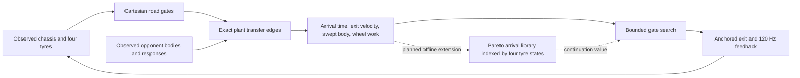

# solinator 6.1

Research audit and design, 30 September 2026. The target is a **valid 73.000 s Harbor Ring lap**, with sustained stint pace and productive close racing. This is an acceptance target, not a measured achievement.

## Scope and evidence

The authoritative current environment is `../Phantom/benchmark/host/astra`, using its unmodified GT, Harbor Ring, tyre law, wake calculation, collision solver and 120 Hz chassis tick. Its five physical source files match the earlier sibling Benchmark byte for byte. Existing controller code is research evidence and supplies competitor adapters; none is imported into solinator's planning or execution. New controller code lives in this directory; the current Benchmark receives registration, presentation and build changes. Existing local edits are preserved.

The pins below describe the original audit of the sibling Benchmark. The current measured field is Astra, DeepSeek NOVA, VORTEX, PHANTOM and Gemini Supreme v4. The original Supreme 3.2 measurements are historical. Source fingerprints in each new result identify the actual current code.

The active Benchmark manifest identifies Astra `ce7630e85425958582e86048e7d28e3bc1f6e78b`, Supreme 3.2 `0a97e974d5c71fbb6125dabea3f4efa992282fb2`, NOVA V4.2 `14e03309e3246a64607fed7d3eac3d5525efaa65`, and VORTEX `bd87710164cbda6eb7add69a8b9f3030f1ac2e69`. The local VORTEX subject has pre-existing edits in vehicle-envelope, corridor-generator and trajectory-refiner, so a run against it must say **local working tree**, not pinned VORTEX. Benchmark itself also has pre-existing edits. Its README describes an older field: the runtime bridge registry and current manifest are the stronger evidence.

PHANTOM was audited before new controller work as an explicit design constraint and is now a measured current competitor. Its active implementation is `../Phantom/benchmark/subjects/phantom/src`; the standalone copy embeds it under `src/phantom`. Looking only at the inherited `src/sim/controller.js` in VORTEX or PHANTOM would misidentify both architectures.

## Competing research systems

Gemini Supreme v4 is materially different from 3.2. Its native `RacePlan` optimizes a Cartesian free-air line and lap-time profile offline. `SpeedProfile` supplies a g-g-v envelope with live tyre rescaling, followed by lagged lateral/yaw tracking. In the current adapter `traffic` defaults to false: observed fast laps do not establish combat ability. PHANTOM's adapter calibrates its native ghost against the identical host, then uses exact-plant knot shooting and warm MPPI refinements. Both have been measured as current competitors rather than inferred from their older names.

| System | Fundamental geometry assumption | Vehicle execution assumption | Opponent occupancy assumption | Tyre assumption |
| --- | --- | --- | --- | --- |
| Gemini Supreme v4 | Native offline Cartesian `RacePlan` line and time optimization; g-g-v speed profile. | Lagged cascaded lateral/yaw feedback; live tyre envelope and rear-slip governor execute the free-air reference. | Traffic is disabled by default in the current adapter, so free-air performance is not evidence of defensive or overtaking awareness. | Average thermal scaling and warm utilization reserve rescale the speed profile; wheel slip governors limit execution, rather than a four-resource arrival graph. |
| Astra | Elastic/time-adjusted nominal line; Harbor-specific entry and arc repairs; quintic lateral departures and explicit return continuations. The selected path has its own physical curvature, but proposals remain related to a nominal line. | AdaptiveDriver tracks selected geometry, evaluates reduced dynamic chassis rollouts, and applies speed/brake and recovery supervision. | Measured relative station/lateral state, predictions, risk/contact costs and committed attack/defend/overlap states. Battle memory preserves sides. | Live thermal/pressure/wear grip, separate axle factors, projected rear heat and thermal freedom. Some historical traffic and thermal blends withdraw performance allowance. |
| Gemini Supreme 3.2 | Global geometric optimum in Frenet coordinates, analytical speed sweep, downstream value expansion; local lattice and combat actions deform that solution. | Coupled MPCC evaluates steering/longitudinal demands, tyre friction limits and transient behaviour. Full-plant adaptation enters through Benchmark's shadow/spec bridge. | Game-theoretic action utilities, causal observed response, multi-apex scan, terminal pass states and anti-twitch commitment. A richer model does not prove its predictions are accurate in this plant. | Analytical envelope and live grip adaptations support execution; heat and wear are not a full-lap resource state in the global geometric solve. |
| NOVA V4.2 | Measured/generated free-air reference, spatial oracle, topology discovery and a reachable corridor graph. A homotopy is selected before coupled execution. | Coupled controller with local transient-model refinement, physical curvature and longitudinal budgets; FREE_AIR and battle continuations share reference infrastructure. | Latent intent posterior over observed opponents; scenario occupancy tubes; free intervals; authoritative candidate q(t) checks and episode commitments. Uncertainty thresholds can remove an aperture before a physical controller tests it. | Live telemetry scales speed and lateral authority; driven axle usage and thermal/slip budgets enter execution. The main topology graph is not a four-tyre resource graph. |
| VORTEX | Offline oracle/track atlas; deformable quintic corridors, owned space and latched acquisition; downstream multicorner continuations. | Servo, dynamic refinement and actuator allocation; measured driven-axle ellipse plus tyre prediction and thermal marginal benefit. | Filtered opponent state, continuous swept clearance, corridor ownership and attack contracts. Aggression is executed within owned corridors. | Explicit front/rear reserve and tyre-law-derived grip; thermal torque price and rear stability. This is already more than an average-temperature limiter. |
| PHANTOM | Ghost tape supplies geometry and a progress/value clock. | Exact-plant control-knot shooting and MPPI-style blending, warm started between plans. | Time-sampled opponent field and footprint cost; pursuit offsets seed alternatives. | Four-wheel sliding work gets temperature-dependent shadow prices, with stint projection and weaker-axle grip. |

This table describes code assumptions, not a performance ranking. More layers, richer names, or an architecture audit score do not establish a faster or better racing controller.

Primary audit entrypoints, relative to `../benchmark`: `sandbox/bridges/{index,astra-bridge,gemini-bridge,nova-bridge,vortex-bridge,phantom-bridge}.js`; `subjects/astra/src/sim/{ai,planner,controller,performance}.js`; `subjects/gemini-supreme/src/ai/v2/{NextGenAIController,GlobalTimeOptimalEngine,GameTheoreticCombatEngine,CoupledMPCCController}.js`; `subjects/nova/src/ai/nova/{nova-driver,topology-planner,belief-occupancy,coupled-controller}.js`; `subjects/vortex/src/ai/vortex/{vortex-driver,atlas/track-atlas,planning/corridor-generator,control/actuator-allocator,estimation/vehicle-envelope}.js`; `subjects/phantom/src/{phantom-driver,sampler,field,tyre-price}.js`.

## What the plant actually rewards

Harbor Ring is 2704.619248914569 m, 544 road samples, asphalt half-width 8.2 m and 1.25 m kerbs. Positive host lateral is right; local +Z is forward; heading is `atan2(tx,tz)`. Benchmark's Gemini adapter changes coordinate conventions. solinator uses host coordinates directly.

At station 864.1524 m the authored centreline curvature is -0.1567514 /m, while at 877.2061 m it is +0.0672202 /m. The road around these points is wider than this short artificial hook. Following centreline curvature creates a false braking demand. Even corrected offset paths can inherit ill-conditioned station derivatives. The solution should inspect Cartesian road geometry and simulate actual wheel positions, rather than trusting the circuit description's label "heavy-braking hairpin". **Full throttle at T1 is a hypothesis to test at a particular approach speed and tyre state**, not a hard-coded instruction regardless of car state.

The tyre force model rewards moderate transient slip and then loses force after saturation. Slip power directly heats surface/core and causes wear: `wear += slipPower * dt * 1.7e-10 * (1 + max(0,surface-115)/35)`. Grip includes core-temperature curvature, absolute-pressure evolution, load sensitivity and `1 - .35*wear`. A brief slide may buy rotation; sustained driven-wheel slip borrows time from later corners and laps. Rear grip can fail before the four-wheel average gives a useful warning.

Wake cuts drag by up to `.42*wake` and downforce by `.16*wake`, with ride platform and damage also affecting force. A tow is worth pursuing on a straight and cannot be credited as free cornering grip. OBB collision impulses cost momentum and damage; deliberate contact is not a viable substitute for gap planning.

## New core: gate-transfer graph

A node is a **road gate plus an arrival state**, not an offset on a racing line:

`N = (gate, x, z, heading, u, v, yawRate, steering, gear, wheel omega/alpha/kappa, four surface/core/pressure/wear states, arrival time)`.

An edge is an **executed feedback maneuver** propagated through the canonical plant from that node to a later gate. It stores time, real swept body footprint, wheel work, terminal state and feasibility. The graph is in Cartesian road space. Track station is retained for progress/timing and road lookup, not as the geometry that every maneuver must follow.

Road gates are broad cross-sections with several feasible arrival ports, including ports through the usable interior of a numerical centreline hook. A geometry seed is derived independently from the road; it is a search initializer, never a ghost tape or an imported opponent oracle. A transfer can skip seed samples if its physical swept footprint remains on the drivable road. There is no requirement to return to a preferred offset while another transfer is faster.

The online solver expands arrivals by **gate/arrival-time/exit-velocity/tyre-resource state**. Continuations compare travel time and retained exit momentum at the same downstream gate; a shorter horizon is never rewarded merely for stopping earlier. Two feasible states at the same gate must not be merged if one has less tyre resource but earlier arrival: retain the Pareto alternatives. The initial executable prototype uses a bounded two-stage beam and online plant shooting. The full offline resource-indexed transfer library is a subsequent scaling step, not claimed to be present in the prototype.

This differs from line + profile + offset candidates (Astra), optimum + combat + MPCC (Supreme), latent homotopy + q(t) (NOVA), oracle + corridor ownership + allocation (VORTEX), and ghost-clock + random control-knot MPPI (PHANTOM). It does not import their lines, optimizers, opponent beliefs, tactical state machines or execution controllers. Exact plant propagation is an evaluation instrument shared with PHANTOM; the graph's arrival-state representation, terminal costs and deterministic port expansions are different.

## One physical transfer representation for pace and combat

The revised prototype first validates the free-air transfer over complete physical stints. Its geometry is improved by Gaussian world-space gate displacement trials scored on total time, validity, rear temperature and fade. It does not learn from a competitor line or ghost. Execution follows the actual host power curve and recomputes its own arrival-speed initializer from live weakest-axle grip. A temperature-triggered conservative initializer keeps long-stint execution viable; measurements must disclose its pace cost.

Online expansion runs when a visible body can conflict or an encounter needs a physical return to the free-air gates. A faster distant car does not trigger gratuitous port changes. Ending combat is itself a tested transfer: switching straight from an outside passing port to the free-air command can demand an infeasible corner entry. `REJOIN` retains physical expansion until that transition is executable. The optional continuous free-air expansion mode remains an experimental ablation, disabled in the deployed configuration.

Every planning cycle includes the momentum-preserving transfer. Opponents constrain edges by their **time-stamped swept bodies**, not by a global "traffic nearby" speed multiplier. Braking belongs to the transfer which actually needs it. A pass can accelerate on a separate safe port while the blocked port slows. A closing gap can be selected before a reactive following rule stops the car.

Opponent predictions use only observed position, velocity, yaw, yaw rate and successive observations; never rival future controls or internal intent. Evaluate continued motion and bounded lateral drift responses. Do not inflate every response into one impenetrable union over the entire horizon. Collision avoidance is strict in the immediate executed prefix; future uncertainty is a cost and prompts replanning. Record model residuals to calibrate the future response spread.

Attack and defence are outcomes of arrival advantage and aperture ownership. A retained pass receives value only when the ego's rear clears the rival's front and the next gate remains feasible. A defence closes the rival's prospective route **before overlap**; an overlapping car's actual footprint removes that port. Latch an executable gate exit rather than an ATTACK mode or a nominal side. Permit switching when the old transfer becomes infeasible or another has a material continuation advantage. No automatic slow mode activates just because a rival is close.

Squeezing means using available width while retaining body clearance. It does not mean commanding overlapping footprints. Drafting, switchbacks and pressure are profitable transfers if measured exit progress and wheel work justify them. The planner should be decisive about feasible moves and equally decisive about rejecting a transfer whose exact propagation leaves the road.

## Tyres are a resource state

Carry four wheel states through every rollout. Use terminal grip loss and additional wear, weighted by remaining stint, plus predicted axle imbalance to price a transfer. Avoid a blanket slip-angle prohibition: allow a short high-work maneuver when its arrival advantage exceeds its future grip cost. Once the extra yaw stops producing time, reject the sliding transfer. There is no scripted lap number at which speed drops and no averaged grip floor masking a failed rear axle.

A multi-lap calibration evaluates total stint time, valid laps, rear heat, asymmetric wear and late-lap geometry errors together. A single fast lap on overheated tyres cannot win calibration by itself. Re-evaluate the same transfer from warm/worn states; a library edge certified from fresh tyres is not certified from arbitrary tyres.

## Acceptance and falsification

1. Plant parity: identical controls give identical wheel/chassis evolution; speculative rollouts never deposit rubber into the live track or mutate the live car.
2. Geometry: body footprint and all wheel surfaces checked through T1 and every complex; use actual Cartesian yaw demand, path distance and track projection. No progress teleports, setup edits, tyre resets, collision changes or track edits.
3. Solo: grid start and official crossing protocol, all lap times and validity, 4- and 8-lap stints. Primary target <=73.000 s valid lap. Secondary target: late-stint mean no more than 1.0 s above the early warm-lap mean, with no recovery.
4. Combat: slower lead, blocked inside/outside, two-car gap, closing gap, rival drift, side-by-side corner, rear attack and switchback. Count retained passes, lost momentum, sustained overlap, severe contacts, offtrack and damage. Failure of a scripted gap is useful falsification, not permission to lower collision costs blindly.
5. Fair campaign: all five current competitors on identical host/setup/tyre initial state, rotated grids, at least four laps. Report time relative to each controller's solo stint and finish rank. Separate field contacts from ego-involved contacts. An earlier four-rival campaign does not establish this result.
6. Runtime: report mean/p95/worst planning latency as well as simulation time. A fast offline controller is not a real-time racing controller until its budget is demonstrated.
7. Ablations: gate bypass vs seed-only; exact propagation vs reduced dynamics; tyre terminal resource vs no resource cost; future response scenarios vs constant velocity; continuation/commitment vs greedy gate. Keep the architecture only if its distinguishing mechanisms earn their cost.

## Implemented prototype and scaling boundaries

`src/road.js` builds an independent Cartesian gate mesh with smoothing and spatially spread clearance corrections. It measures its own physical circumcircle curvature; it never uses the authored centreline kink as a speed demand. `src/policy.js` supplies feedback toward a position/velocity port and an analytical speed initializer, including live tyre response. `src/plant.js` propagates the original Vehicle solver on a separate body and suppresses speculative rubber deposits. Instance functions bound to live bodies are explicitly excluded from snapshots.

`src/driver.js` expands deterministic port transfers in two stages and compares their arrivals at the same downstream gate. Each edge propagates full chassis, wheel and tyre dynamics. Immediate nominal opponent clearance is checked at every 120 Hz rollout step; more distant bounded lateral responses remain costs. Exit gates are anchored across replans. The road-footprint constraint retains an execution margin; a predicted sustained body slip above .32 rad at driving speed rejects the edge while allowing moderate transient slip. When all edges already fail, a physical .25-second prefix ranks reduced overlap, road departure and spin instead of rewarding nominal arrival time from one failed tick. An escape commitment survives the opponent leaving observation. Resource costs include four-wheel work, warm-stint thermal/pressure slopes, remaining-stint thermal memory, wear and terminal grip. Speed is not reduced because a global combat flag is set.

The current implementation is a bounded shooting graph, not the complete offline arrival-state library described above. It does not yet merge Pareto arrival nodes, learn calibrated opponent-response distributions, or optimize an entire tyre-indexed periodic orbit. The speed initializer and downstream velocity value are approximations. A short horizon cannot prove that a tyre expenditure wins over eight laps. Measurements in RESULTS.md expose this limitation: the single-lap objective is met, while long-stint degradation remains large.

Optional torque probing, geometric surrogate shaping, velocity tracking and force-inversion ablations exist in research scripts; they are disabled in the promoted configuration. Their trials did not beat physical whole-stint validation. They are not successful mechanisms merely because code exists.

## Integration boundaries

The current Benchmark consumes `sandbox/bridges/solinator-bridge.js`, which imports only this controller and its measured configuration. The six-car cup retains all five rivals. Benchmark's existing worker transport offloads the native solinator controller and returns one control decision for every unchanged 120 Hz host step; there is no nested asynchronous planner and no speculative time advance of the live car. Results remain separate from design claims and record source hashes, local modifications, tick rate and initial conditions. This inclusion is a user-requested research comparison, not a claim that solinator has beaten every rival or solved endurance.

## Next experiments justified by the measurements

The first priority is an actual resource-indexed continuation value beyond the short shooting horizon. Eight-lap measurements show a front-left core near 77 C, front-right near 93 C, rear-left near 120 C and rear-right near 138 C. The rear-right tyre is the dominant resource, and the current rear-average speed initializer plus local four-wheel work price cannot protect it adequately. Build transfer edges from these asymmetric arrival states and fit continuation time from exact multi-gate replays; compare against the present bounded graph at identical initial conditions. Do not merely add a global hot-tyre slowdown to hide the problem.

The second priority is reactive occupancy falsification: accelerating leads, late lateral closes, blocked outer routes, and an opponent defending after ego commitment. Current scripted passes are against predictable port followers. At least one shared-grid contact had high closing speed; measured response residuals and executable counter-transfers are needed before claiming robust squeeze or defence capability.

The third priority is moving expansions off the rendering thread and reusing common first-gate arrivals across continuations. Keep the immediate physical body check synchronous. Reject stale worker plans when the observed chassis or aperture no longer matches their certified arrival state. The method must demonstrate a runtime budget before becoming a default live controller.
